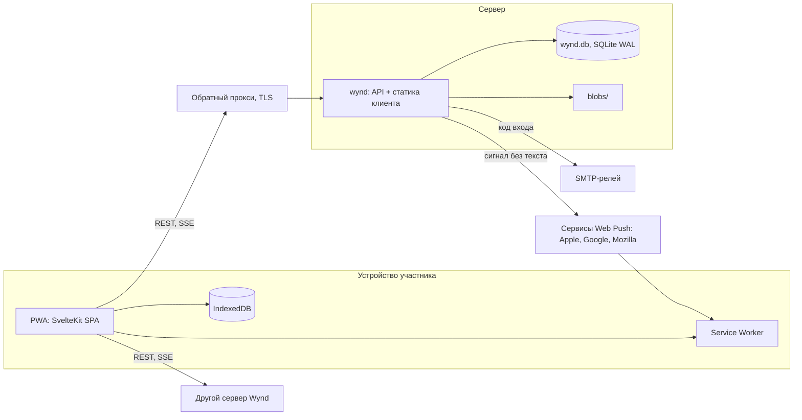
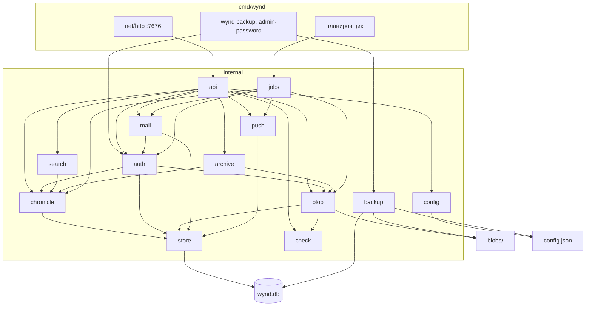
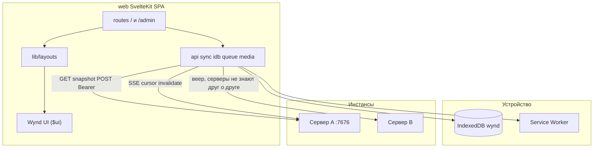

# Архитектура

Как устроен Wynd: из каких частей, как они связаны и почему именно так. Подробные решения по темам — в справочниках [сервера](docs/reference/server-reference.md), [клиента](docs/reference/client-reference.md) и [библиотеки интерфейса](docs/reference/ui-components.md). История выбора стека и отвергнутые альтернативы — [docs/stack.html](docs/stack.html). Образ продукта — [docs/wynd.html](docs/wynd.html).

## Коротко

Один бинарник Go отдаёт API и клиент. Клиент — SvelteKit SPA, вшитый в бинарник через `go:embed`, ставится на телефон как PWA. Данные — один файл SQLite и каталог файлов рядом. Инстанс рассчитан на домашний масштаб: несколько человек и их круги, а не SaaS.

## Принципы

Три ограничения, которые определили стек:

| Ограничение | Откуда | Что отсекает |
|---|---|---|
| Один технарь ставит для всех | Сервер поднимает один человек для своих | Микросервисы, отдельный деплой фронтенда, Matrix |
| Офлайн и несколько серверов на клиенте | Круги живут на разных серверах, писать можно без сети | Чистый SSR без JS, нативные клиенты под каждую платформу |
| Сервер не трогает медиа | Дешёвый VPS или домашний диск | ffmpeg на сервере, очереди перекодирования |

Отсюда сознательные отказы:

- **Без сквозного шифрования.** Даёт серверный поиск, дешёвую синхронизацию и тонкий клиент. Цена — администратор сервера может прочитать всё ([SECURITY.md](SECURITY.md)).
- **Без федерации.** Круг живёт на одном сервере, серверы друг о друге не знают. Круги с разных серверов собирает клиент.
- **Сжатие на клиенте.** Фото и видео сжимает телефон, оригиналы не покидают устройство. Сервер хранит байты как есть.
- **Глобальные идентификаторы** (UUID v7) с самого начала — чтобы перенос круга между серверами не требовал перенумерации.

## Не планируется

Отвергнуто насовсем, а не отложено. Отложенное — в [плане 46](docs/plans/46-open-questions-and-debt.plan.md).

| Что | Почему |
|---|---|
| Сквозное шифрование | Убивает серверный поиск и превью, ключ не из чего вывести при входе по коду ([SECURITY.md](SECURITY.md)) |
| Федерация, ActivityPub | Серверы не знают друг о друге — это свойство продукта; круги собирает клиент |
| Нативные клиенты iOS и Android | Двойная разработка всех экранов; PWA достаточно |
| PostgreSQL | Домашний масштаб, один процесс — SQLite хватает |
| Перекодирование медиа на сервере | Нагрузка на дешёвый VPS; сжимает телефон |
| Шифрование секретов в базе | Ключ пришлось бы хранить рядом с базой |

Почему отвергнуто остальное (GraphQL, React, Tailwind, сторонний роутер и другое) — [docs/stack.html](docs/stack.html), «Отвергнутые альтернативы».

## Общая схема



Администратор ходит в ту же программу: панель `/admin` — второй layout того же клиента.

## Репозиторий

```text
wynd/
├── VERSION        # единый номер версии
├── cmd/wynd/      # main(): сервер и команды wynd backup, wynd admin-password
├── internal/      # пакеты сервера — по одному на предмет (карта ниже)
├── web/           # SvelteKit: клиент и панель; сборка web/dist → go:embed
│   ├── src/lib/   # ядро (api, sync, idb, queue, media, push …) и Wynd UI
│   └── src/routes/
├── deploy/        # install.sh, systemd, Docker, Caddy, шаблоны прокси (Apache, nginx, Traefik)
├── scripts/       # сборка, тесты, локальный запуск (Windows)
├── assets/        # знак, лок, иконки
├── .gitea/        # CI
└── docs/          # образ продукта, стек, макеты, справочники, аудиты, планы
```

Идентификаторы и поля API — на английском (`circle_id`, не `krug_id`). Тексты интерфейса, документация, сообщения коммитов и большая часть комментариев — на русском.

## Сервер

Один процесс: HTTP на `:7676`, планировщик суточной рутины и команды обслуживания (`wynd backup`, `wynd admin-password`). Пакеты `internal/` — по одному на предмет:



Стрелка — импорт Go (`go list -f '{{.Imports}}'`). Не показаны листовые пакеты, которые импортируют многие: `xtime` (метки времени), `uid` (UUID v7), `version`, `proxy` (таймаут прокси для сниппетов и проверки). `backup` не ходит через `store`: он открывает `wynd.db` сам и снимает копию `VACUUM INTO`, рядом кладёт `config.json`, `keys/` и блобы.

- **HTTP.** `net/http` с методами в шаблонах `ServeMux`, без стороннего роутера. REST + JSON под `/api/v1`. OpenAPI-спеки в `internal/api` — оглавление маршрутов, а не контракт: тесты сверяют с роутером только список маршрутов.
- **Хроника.** Каждое действие — событие в таблице `events` с растущим `seq`, записанное в одной транзакции с проекцией (записи, комментарии, дни, участники). Проверки прав — в `internal/chronicle`.
- **Снимки.** Экран круга (лента, дни, сетка, карта) читает готовый снимок текущего состояния с учётом отрезка видимости участника; клиент хронику не проигрывает.
- **Хранилище.** SQLite в режиме WAL — единственный драйвер. Миграции только вверх, применяются при старте. Файлы вложений — в `blobs/`, сервер их не перекодирует. Раскладка каталога данных — в [README](README.md).
- **Суточная рутина.** Уборка брошенных загрузок, осиротевших файлов, истёкших приглашений, сессий и кодов, пересчёт места. Пропущенный запуск догоняется.

## Синхронизация

1. Участник пишет: `POST` на сервер круга. Сервер пишет событие и проекцию одной транзакцией.
2. Клиент держит поток `GET /api/v1/sync` (SSE) с курсором — номером последнего события. Сервер раз в 2 секунды опрашивает журнал и досылает события после курсора.
3. Событие не несёт данных для экрана — оно говорит, что снимок устарел. Клиент заново читает снимок.
4. Без сети запись ложится в очередь IndexedDB и отправляется позже; повтор безопасен — сервер узнаёт запись по `client_id`.

Первый кадр потока несёт `max_seq`: если курсор клиента больше, сервер восстановлен из бэкапа, и клиент сбрасывает курсор и снимки сам.

## Клиент



Страницы не содержат `fetch` — только ядро, layout и компоненты.

- **PWA.** Service worker (`@vite-pwa/sveltekit`) кэширует оболочку; установка на экран телефона. Нативных клиентов нет.
- **Несколько серверов.** Круги с разных серверов клиент собирает сам: у каждого сервера своя сессия, свой поток и своя группа в очереди. Серверы друг о друге не знают.
- **IndexedDB.** Снимки, очередь, сессии, пины и группы кругов — всё на устройстве.
- **Медиа.** Фото — Canvas в WebP или JPEG, видео — WebCodecs через `mediabunny`, до загрузки. Оригиналы остаются на телефоне.
- **Интерфейс.** Своя библиотека Wynd UI на токенах из макетов; поведение оверлеев — Bits UI. Экран собирается только из `$ui` и `$lib/layouts` — это проверяет `npm run check:ui`.

## Почта и пуши

- **Почта** — внешний SMTP-релей: только коды входа. На loopback без релея код пишется в журнал сервера.
- **Пуши** — Web Push с ключами VAPID, генерируются на инстанс. Уведомление сигнальное: круг, тип события и имя круга заголовком, без текста журнала; текст клиент рисует после синхронизации. Тело шифруется ключом подписки (RFC 8291), сервис доставки его не читает.

## Развёртывание

Бинарник статический (`CGO_ENABLED=0`). Два пути: `deploy/install.sh` (systemd, по желанию Caddy) и Docker Compose. TLS держит обратный прокси; шаблоны Apache, nginx и Traefik — в `deploy/proxy/`. Без HTTPS не работают service worker, пуши и камера. Шаги — в [README](README.md).
