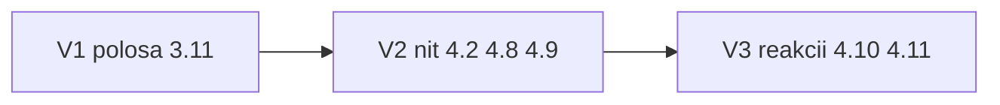

# Макеты после волны F

Догнать продукт до правок [screens.html](../visual/screens.html) после волны F (`25f0649`, 5 сентября). F (панель) закрыта в 0.1.34. Здесь только то, что на макете есть, а в приложении нет. Хвосты самой панели — [wave-f-tails.plan.md](wave-f-tails.plan.md).

**Эталон:** [screens.html](../visual/screens.html) `#e3-1`, `#e3-11`, `#e4-2`, `#e4-8`–`#e4-11`.  
**Не трогать:** `docs/visual/screens.html`, `docs/wynd.html`, админку / волну F, группы 2.6.

Инструкция для исполнителя: **развилки ниже закрыты**. Если в волне не сказано «выбери» — выбирать нельзя. Thinking-модель не нужна. Три волны = три коммита в `main` (не GitHub PR). Приёмка каждой волны: браузер по затронутым экранам + `go test ./...` + `npm run check:ui` + `npm run check` + `npm run test`.

---

## Что уже закрыто (не делать)

6.11 кадр, 9.10 почта, текст 5.2 «День общий», `i-gear`, compose 4.1/4.7, вложения 4.6.

---

## Три волны



| Волна | Макеты | Коммит |
|-------|--------|--------|
| 1 | 3.1 / 3.11 полоса журнала | шеврон уносит черновик на 4.1 |
| 2 | 4.2 / 4.8 / 4.9 обсуждение | бумага, CommentBar без фото и шеврона |
| 3 | 4.10 / 4.11 реакции | четыре значка в карточке |

---

## Закрытые развилки (не переоткрывать)

### Общее

| Тема | Решение |
|------|---------|
| screens.html | Не менять. |
| Новые `.svelte` в `$ui` | Не создавать. Править `CommentBar`, `Icon`, страницы, CSS. |
| Новые npm-пакеты | Запрещены. |
| Клавиатура на макете | Не рисовать. Настоящий `textarea`. |
| Каретка 3.11 | Не фейкать. |

### Полоса журнала (волна 1)

| Тема | Решение |
|------|---------|
| ПК, пустое поле | Оставить `prefersInlineCompose()` из 0.1.32: `(hover: hover) and (pointer: fine)` — только фокус. Тач + пустое — 4.1. |
| Фото в полосе | Не пикер. Как шеврон: `oncompose` с черновиком. |
| Enter в журнале | Перенос строки. Отправка только `.send`. |
| Отмена на 4.1 | Черновик в полосу не возвращать. `sessionStorage` съедается в compose, как сейчас. |
| Шеврон и фото | Только если передан `oncompose`. Иначе (комментарий) — ни того ни другого. |
| Иконки в поле | `IconButton` `photo` и `chevr`, `stopPropagation`, обе → `oncompose`. |
| Пустое / полный | `.send.off` когда пусто; `.f.ink` когда `canSend`. Локальный `opacity` у `.send` убрать. |
| Длинный текст | `.comp .f { min-width: 0 }`. |

### Обсуждение (волна 2)

| Тема | Решение |
|------|---------|
| Layout | `CircleLayout` `tabs={false}` `title="Обсуждение"`, не `FormLayout`. |
| Полоса | Тот же `CommentBar` через layout: `onCommentSend` есть, `onCommentCompose` нет. Placeholder `Написать комментарий…`. |
| Enter в комментарии | Перенос строки, не отправка. Круглая `.send`, пустое — `.off`. |
| Нить | `.thread` > `.cmt`: аватар 28px, `.who` имя+время в одной строке, слова сразу под ними, волосяная черта. Не `.row2`. |
| Время реплики | Только часы `formatClock` (`14:20`), не «сегодня, 14:20». Добавить в `time.ts`. |
| `.acts` | Колонка всегда, `flex: 0 0 40px`. Иконки только у своих и пока `isEditableActive`. Чужие и вышло окно — пустая колонка той же высоты. |
| Правка | На месте, `.ced`. Карандаш и корзина прячутся. `Button` «Сохранить» / «Отмена». Подписи про расхождение окон нет. |
| Удалить | Без диалога. `deleteComment`, строки в хронике нет (как сейчас на сервере). |
| Шапка записи | Карточка остаётся. Cover — 44×44 в `headerRight`, тап → альбом. Своя запись и окно живо — `TextButton` «править» слева от миниатюры (дверь на 4.7; на 4.2 её нет, без неё править нечем). Вложения строкой под текстом. Реакций на 4.2 нет. |
| Превью в ленте | `.cm` — сосед после `PostCard`, не внутри. CSS как в макете: `.post:has(+ .cm)` скругляет низ карточки. Клик по `.cm` → обсуждение. Подсказку дня (3.9) с класса `.cm` снять. |

### Реакции (волна 3)

| Тема | Решение |
|------|---------|
| Значения | В API и IDB только `heart` \| `laugh` \| `surprise` \| `anger`. Не Unicode, не эмодзи с клавиатуры. `SetReaction` иначе → `ErrInvalid`. Тесты `🔥` / `💛` / `❤️` переписать на ключи. |
| Старые строки в БД | Миграции нет. В чипе неизвестное рисуется как сердце. Новый PUT только ключ. |
| Одна на человека | Как сейчас: upsert. Смена значка — тот же PUT, окно сбрасывается с `created_at` (уже в `SetReaction`). |
| Чипы | По одному `.one` на вид, порядок — первое появление. Иконка вида + имена через запятую. Тап → 4.5 (`?reactions=`), не пикер. |
| Плюс | Не ставит реакцию. Тогглит `.rxpick` у этой карточки (локальный `pickerPostId`, не URL). Другая карточка — сменить id. Повторный плюс — закрыть. Пока пикер открыт, плюса в `.rx` нет. |
| Пикер | Четыре `.rcho` без подписей. Свой выбранный — `.on` (`--ct`). Повтор по своему — DELETE. Другой значок — PUT. |
| Плюс виден | Не соло-круг **и** (своей реакции нет **или** её окно ещё живо). Вышло — плюса нет, имена остаются, тап по именам → 4.5. Соло — плюса нет, как 3.7. |
| Своя | Сверять `identity_id`, не имя. |
| JSON | `reactionResponse` += `appendEditPolicy` (`editable_until` / `edit_window_sec`). Тип клиента — те же поля. |
| DELETE HTTP | URL не менять: `DELETE .../posts/{post_id}/reactions`. Сейчас в `DeleteReaction` уходит `post_id` вместо id реакции — смотреть свою живую реакцию на этот пост, потом существующий `DeleteReaction` по id. Тесты инварианта по id не ломать. |
| Очередь офлайна | В payload уже `emoji` — писать ключ. |
| 4.5 | Не перерисовывать. Все имена записи, как сейчас. |
| Где разметка пикера | В ленте `[id]/+page.svelte` внутри сниппета реакций. Новый компонент не заводить. |

---

## Волна 1 — полоса 3.11

**[CommentBar.svelte](../../web/src/lib/components/overlays/CommentBar.svelte):** при `oncompose` — фото и шеврон; `.f.ink`; `.send.off`; тап по полю не менять.

**[ui.css](../../web/src/lib/styles/ui.css):**

```css
.comp .f { flex:1; min-width:0; /* остальное как сейчас */ }
.comp .f.ink { color:var(--ink); }
.comp .send.off { opacity:.45; }
```

**Smoke /dev/ui:** `onCommentSend={() => {}}` и `onCommentCompose={() => {}}` на e3-1, иначе полосы нет.

Лента и compose не трогать: `openComposeFromBar` уже кладёт черновик в `sessionStorage`.

- [ ] Шеврон и фото на ленте → 4.1 с текстом; пустое на таче → 4.1; на ПК пустое фокусирует; отправка с полосы без медиа; комментариев ещё нет на CommentBar

---

## Волна 2 — нить 4.2 / 4.8 / 4.9

**[ui.css](../../web/src/lib/styles/ui.css)** — блоки из макета: `.thread`, `.cmt`, `.who`, `.acts`, `.ced`, `.post:has(+ .cm)`, сосед `.cm` (подвал). Старый `.cm { margin-top:11px }` для соседа не использовать.

**[posts/[postId]/+page.svelte](../../web/src/routes/circles/[id]/posts/[postId]/+page.svelte):** `CircleLayout`; нить `.cmt`; правка `.ced`; свой `.comp` с `Input`/`→` удалить.

**Лента:** превью комментариев — сосед `PostCard`; клик открывает обсуждение. Подсказка дня без класса `.cm`.

**[time.ts](../../web/src/lib/format/time.ts):** `formatClock`; тест.

**Smoke e3-1:** `.cm` снаружи карточки.

- [ ] Обсуждение как 4.2/4.8/4.9; лента — бумажный подвал; Enter в комментарии не шлёт; шеврона и фото в полосе комментария нет

---

## Волна 3 — реакции 4.10 / 4.11

**Иконки:** пути `i-laugh` / `i-surprise` / `i-anger` из screens.html → [icons.svg](../../web/static/icons.svg) и имена в [Icon.svelte](../../web/src/lib/components/Icon.svelte).

**Сервер:** белый список ключей в `SetReaction`; `reactionResponse` с окном; DELETE по посту → своя реакция. Тесты инварианта и архива — ключи, плюс отказ `💛`.

**Клиент:** `setReaction(..., emoji)`; чипы по видам; плюс открывает `.rxpick`; плюс гасится по окну своей реакции и в соло. [present.ts](../../web/src/lib/journal/present.ts) — группировка имён.

**CSS:** `.rxpick`, `.rcho`, `.rcho.on` как в макете.

- [ ] Плюс не ставит втихаря; четыре значка; смена и снятие; вышло окно — плюса нет; 4.5 с имён живёт; `go test` на ключи и DELETE по посту

---

## Справка (после волны 3, в том же третьем коммите)

[client-reference.md](../reference/client-reference.md): полоса 3.1/3.11; комментарий — тот же `CommentBar` без `oncompose`; реакции — ключи и пикер в карточке; 4.5 только имена.

---

## Глобально не делать

Пикер с иконки фото; Enter-отправка; возврат черновика с «Отмена»; вторая панель под реакции; Unicode в PUT; миграция старых эмодзи; пикер на экране обсуждения; новые пакеты; правки `screens.html`; админка.

**Файлы:** `CommentBar.svelte`, `ui.css`, `icons.svg`, `Icon.svelte`, `circles/[id]/+page.svelte`, `circles/[id]/posts/[postId]/+page.svelte`, `time.ts`, `posts.ts`, `types.ts`, `present.ts`, `internal/chronicle/content.go`, `internal/api/journal.go`, тесты chronicle, smoke e3-1, `/dev/ui`, `client-reference.md`
