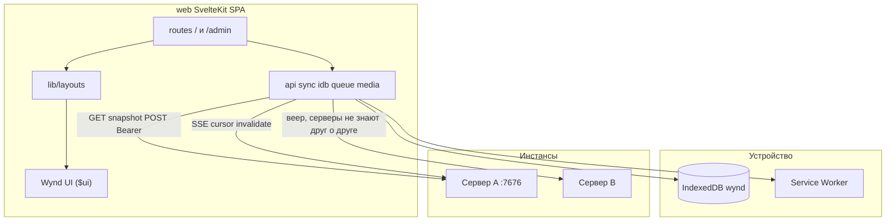

# Клиент — справочник

Сжатая выжимка из закрытого плана реализации. Эталоны: [wynd.html](../wynd.html), [stack.html](../stack.html), [screens.html](../visual/screens.html).  
Компоненты и layout'ы: [ui-components.md](ui-components.md).

---

## Архитектура

Страницы не содержат `fetch` — только kernel + layout + компоненты.

**Дерево ядра:** `web/src/lib/api/`, `session/`, `idb/`, `sync/`, `queue/`, `media/`, `push/`, `format/`, `layouts/`.

`PhoneFrame` — корень layout'ов в бою (`app` и цвет круга). `StatusBar` — только в `/dev/*` и в layout'ах при `app={false}` (имитация кадра на десктопе). Макеты `screens.html` и образ `wynd.html` не синхронизировать с номером `VERSION`.

---

## Запрещено ставить

Tailwind, shadcn-svelte, axios, tanstack-query, Dexie, redux/zustand, date-fns/dayjs, tus/uppy, Mapbox, jsQR, Playwright как обязательность, adapter-node, SSR, Google Fonts CDN.

**Разрешено:** `idb`, `openapi-typescript`, `exifr`, `leaflet`, `leaflet.markercluster`, `@vite-pwa/sveltekit`, `vitest`, `fake-indexeddb`, `bits-ui` (только внутри `$ui`), `qrcode` (админ 9.7).

---

## Ключевые решения

### Чтение: снимки, не проектор

- Клиент **не** материализует хронику из `events[]`.
- Экран читает snapshot; SSE инвалидирует → повторный GET. Сервер SSE — опрос SQLite раз в 2 с, не LISTEN/NOTIFY.
- Очередь офлайна — оверлей с `.q` поверх снимка.
- Онлайн: POST → refetch. Без optimistic UI, кроме очереди.

### CSS-корень `.ph`

Семантика библиотеки внутри `.ph`. В бою: `
`.

### Состояние

- Svelte 5 runes в `*.svelte.ts`.
- Сессии — `session/session.svelte.ts`; тема `'system' | 'light' | 'dark'`.

### Сеть

- `fetch` через `api/client.ts`, Bearer в `Authorization`.
- Сессии в IDB `sessions`; админ — `admin_session` только для `/api/v1/admin/*`.
- Медиа **не** через `` — только `objectUrl.ts` + кэш IDB.

### Загрузка

- Чанки API, **1 MiB**. EXIF через `exifr` → `entry_date`, `captured_at`.
- Аватар: клиентский кадр, JPEG 512×512 quality 0.85 (`media/crop.ts`). Не `compressImage` (лимит постов 2048).

### Кадр аватара (6.11)

Оверлей на весь экран, как Lightbox; не Sheet и не маршрут. Макет: [screens.html](../visual/screens.html)#e6-11. Тёмный экран только 4.4. `AvatarCrop` сам задаёт светлые `--paper` / `--ink`: иначе наследует `.ph.dark` с `PhoneFrame`.

- Окно круглое (как аватар в ленте). На диск — квадратный JPEG, совпадающий с кругом. Переключателя формы, поворота и фильтров нет.
- Оригинал после кадра не хранится. Сменить кадр — выбрать фото заново.
- **6.5:** пикер → оверлей → `uploadBlob` + `PUT /identity` только по «Готово». Оверлей не закрывать, пока upload и PUT не закончатся; «Готово» в `loading`; ошибка сети остаётся на кадре. Escape и «Отмена» во время upload не закрывают кадр.
- **1.3:** тот же оверлей; кадр в памяти; сначала `POST /invites/{token}/join` `{name, body?}`, потом upload + identity. Нет `avatar_blob_id` в join. Срыв фото после join не блокирует ленту: hint «Фото не загрузилось — поставьте в профиле» и вход в ленту.
- Поворот/ресайз вьюпорта: `clampCropTransform`, без сброса в центр. Tab циклически по «Отмена» и «Готово»; фокус не уходит на поля под оверлеем.
- Жесты: pinch — зум вокруг текущей середины двух касаний (вместе со сдвигом жеста); колесо — к курсору относительно вьюпорта. Затем `clampCropTransform`. Поворота снимка и фильтров нет.
- Код: `overlays/AvatarCrop.svelte`, `media/crop.ts`. Без cropper.js.

### SvelteKit

- `ssr: false`, `adapter-static`, `strict: false`.
- Dev: Vite proxy `/api` → `:7676`.

### UI

- Экран = layout + существующие компоненты Wynd UI. Новые `.svelte` в `$ui` в задаче экрана **не создавать**. Если из библиотеки не собрать — план `docs/plans/<slug>.plan.md` (пробел Wynd UI) и отдельная задача на библиотеку. Guard: `npm run check:ui`; сторож: `.cursor/hooks/ui-screens.mjs`. Форма плана: [ui-components.md](ui-components.md). Тексты — [голос](../wynd.html#voice): «вы», нейтрально; манифест «ты» в UI не копировать.
- Identity в `CircleBar` — `<button type="button" class="idn">`.
- Notify круга и `/settings/app`: одинаковые строки (6.6 = 7.3) через `SettingsRow` + snippet `control` + `Switch`. Поля: `posts`, `comments_mine`, `comments_all`, `reactions` (умолч. выкл.), `events`, `mute_until` (Нет / До завтра / На неделю). «Упоминания» — disabled `Switch checked={true}`, без persist; mention пробивает mute. Архив, identity, servers, deadlines — тоже `SettingsRow`, не сырой `.row2`.
- Круг без доступа — `PlainLayout`, не сырой `
`.
- Список реакций — `OverlayLayout.ondismiss` (Scrim), без второго клик-слоя. Токены знака и пустой ленты: `--mark-w` / `--mark-h` / `--empty-ink`.
- Compose и правка — `/circles/[id]/compose?post=`. `TextArea variant="compose"`; в правке фото/файл — `IconButton` `disabled`.
- Табы круга — **pathname**, не `?tab=`.
- Группы кругов (2.6) и пины — только IDB, без API. Круг в одной группе; закреплённые над папками и не дублируются внутри папки. Удержание 500 мс — закрепление; чипы папок второй строкой `CircleRow` в режиме `card`.

### Панель

Эталон: [screens.html](../visual/screens.html) `#e9-1`–`#e9-10`.

- Нав: Хранилище, Проверка, Сжатие, Доступ, Люди, **Оплата**. SMTP с нав снят; `/admin/smtp` живёт (9.10, `active` «Проверка», назад → `/admin/check`). 9.5 «Настроить» → `/admin/smtp`. Кадры 9.1–9.10 без пункта «Оплата»: это другие разделы панели.
- **9.1** чипы умолчания: Нет / 5 ГБ / 10 ГБ / Своё. 5 и 10 = `n * 1024^3`. Своё: целое 1…1024 ГБ. Таблица: custom=0 — эффективное без «своя»; custom=1 и null — `без квоты · своя`; custom=1 и число — `{N ГБ}` + faint `своя`. Строка → `/admin?circle={id}`; повторный тап снимает query.
- **9.2** на том же `/admin`, не новый маршрут. Чипы: «Как умолчание · …»; pending — `{requested} ГБ` (абсолют); «Без квоты». «Дать» только навигирует на карточку, не `POST .../approve`. «Отказать» — текущий reject. Кнопки `.btn` / `.btn.gh`, не `.act`.
- **9.7** QR `qrcode` SVG в `.qr` в правой колонке, подпись «та же ссылка кодом». Чипы TTL: 3600 / 259200 / 604800. Колонки учёток нет. Под формой — блок «Живые» (`GET/DELETE /admin/invites`, `revokeInvite`). Смена чипов отзывает предыдущую ссылку этой сессии, не копирует живые.
- **9.8** `/admin/people`: клиентский `email.includes`, без API. Фильтр почты — `SearchField` (поле фильтра = поиск). `blocked` → «вход закрыт» во второй колонке рядом с числом. `circle_count===0` → «без кругов», не фильтровать.
- **9.9** `/admin/people/{id}` — только `GET /admin/accounts/{id}`. «последний код» только если `last_login_at`. В строке круга роль и `joined_at` → «участник · с {дата}». Владелец круга — кнопки удаления нет. Второго диалога нет.

---

## IDB `wynd` v2

| Store | Key | Содержимое |
|-------|-----|------------|
| `sessions` | `origin` | `{ origin, name, email, token, account_id }` |
| `admin_session` | `'admin'` | `{ origin, token }` |
| `cursors` | `origin` | `{ origin, seq }` |
| `snapshots` | `${origin}:${kind}:${id}` | JSON + `fetched_at` |
| `queue` | autoincrement | `{ type, origin, circle_id, payload, files[], state, uploads?, error?, created_at }` |
| `media` | `${origin}:${blob_id}` | ArrayBuffer + mime |
| `pins` | `${origin}:${circle_id}` | pin row |
| `groups` | `id` | `{ id, name, circleIds[], collapsed }` |
| `settings` | `'app'` | `{ theme, notify_defaults, circle_meta?, day_prompt_seen?, day_prompt_count? }` |

---

## Маршруты

Эталон — [screens.html](../visual/screens.html).

| Путь | Экран |
|------|-------|
| `/` | 1.5: тот же `Input` «Адрес сервера», что на `/join`; `fetchInstance(resolved)`, не `''` |
| `/invite/[token]` | 1.1 |
| `/join`, `/join/[token]` | 1.6–1.8 |
| `/auth/code` | 1.2 |
| `/circles/[id]/join` | 1.3–1.4 |
| `/circles`, `/circles/new`, `/search` | 2.*; поиск — дни со словом «день», ключ круга режется с `lastIndexOf(':')` |
| `/circles/[id]` | 3.* лента: `lastReadSeq` фиксируется при входе, черта пересчитывается после загрузки; прочитанное — при уходе |
| `/circles/[id]/days`, `.../days/[date]` | 5.1–5.2 / 5.6 имя на месте |
| `/circles/[id]/days/[date]/album` | обложка дня, как альбом записи |
| `/circles/[id]/grid`, `.../map`, `.../search` | 5.3–5.5 |
| `/circles/[id]/compose` | 4.1, 4.7 (`?post=`); `@` — `MemberRow` в карточке, в ленте `.men` без ссылки |
| `/circles/[id]/posts/[postId]`, `.../album` | 4.2–4.3, 4.12 |
| `/circles/[id]/settings` … `/archive` | 6.*; `invite?from=create` — 2.7, назад в круг; запрос квоты — `/quota/request`, чипы как 9.1 без «Нет», не POST текущего потолка |
| `/settings`, `/settings/servers`, `/settings/app` | 7.1–7.3 |
| `/pay`, `/pay/extend`, `/pay/help` | 10.2 / 10.11 / 10.9 |
| `/admin` | 9.1–9.2 хранилище (`?circle=`) |
| `/admin/check` | 9.5 |
| `/admin/compress` | 9.6 |
| `/admin/access` | 9.7 |
| `/admin/people`, `/admin/people/[id]` | 9.8–9.9 |
| `/admin/smtp` | 9.10 |
| `/admin/pay` … `/donate` `/subscription` `/requests/[id]` | 10.6 / 10.8 / 10.10–10.13 / 10.7 |

Шлюз оплаты — layout `/circles` и детей (`required && expired && has_requisites`). Без реквизитов заявку и баннер не показывать. Продление: `max(now, expires_at)+days`. Скриншот обязателен.

Sheet 4.5: `?reactions={postId}` на ленте. Оверлей 6.11 «Кадр»: не маршрут, как Lightbox. Список реакций — `OverlayLayout.ondismiss` (Scrim), без второго клик-слоя.

### Полоса, комментарии, реакции

- **Лента 3.1/3.11:** `CommentBar` в `CircleLayout` — шеврон и фото при `onCommentCompose`, отправка с полосы через `onCommentSend`; пустое поле на таче и иконки ведут на compose 4.1 с черновиком в `sessionStorage`. Enter — перенос строки. `.send:disabled`, пока пусто; `.f.ink`, когда можно отправить. Поле — `TextArea variant="comment"` (класс `.inp`).
- **Комментарий:** тот же `CommentBar` без `oncompose` (нет фото и шеврона); placeholder «Написать комментарий…»; Enter — перенос строки, не отправка.
- **Обсуждение 4.2/4.8–4.9/4.12:** `CircleLayout` `tabs={false}`; нить `.thread` / `.cmt`; время реплики — `formatClock`; правка комментария на месте (`.ced`, имя и часы остаются, карандаш и корзина прячутся). Своя запись, пока живо окно: карандаш (`IconButton` `edit`) в шапке карточки, справа перед обложкой, ведёт на 4.7. Превью комментариев — `CommentPreview` (`button.cm`), сосед `PostCard`, не внутри карточки. Удалить комментарий — без диалога, строки в хронике нет.
- **Реакции 4.10–4.11:** в API и очереди только ключи `heart` | `laugh` | `surprise` | `anger`; на экране — `ReactionBar` (`.rx` / `.rxpick`). Плюс открывает пикер в карточке и не ставит реакцию сам; неизвестное в БД рисуется как сердце. Плюс гаснет в соло и когда окно своей реакции вышло. `groupReactions` / `pickReaction` / `togglePicker` / `?reactions=` — на маршруте, не в `$ui`. Sheet 4.5 — `ReactionListRow`, список имён, без пикера.

---

## Локальный прогон

`go run ./cmd/wynd` и `cd web && npm run dev` (Vite :5173, proxy `/api` → :7676).

**Здесь закрывается:** инвайт → круг → запись → лента у второго → офлайн-черновик → дни/сетка/поиск → `/admin`.

**Здесь не закрывается:** камера, PWA installability, Web Push, TWA, LAN без HTTPS.

---

## Вне scope

TWA, миграция круга, PostgreSQL, UnifiedPush, GDPR-экран, QR-сканер как требование приёмки.
