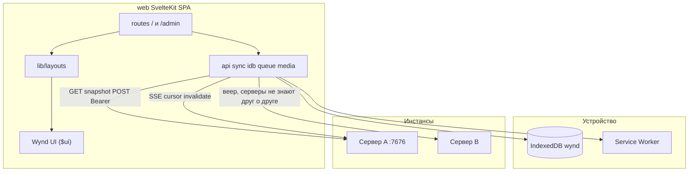
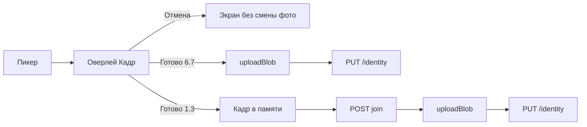

# Клиент — справочник

Сжатая выжимка из закрытого плана реализации. Эталоны: [wynd.html](../wynd.html), [stack.html](../stack.html), [screens.html](../visual/screens.html).  
Компоненты и layout'ы: [ui-components.md](ui-components.md). Сверка маршрутов с макетами: [screen-function-audit.md](../testing/screen-function-audit.md).

---

## Архитектура

Страницы не содержат `fetch` — только kernel + layout + компоненты.

**Дерево ядра:** `web/src/lib/api/`, `session/`, `idb/`, `sync/`, `queue/`, `media/`, `push/`, `format/`, `layouts/`.

`PhoneFrame` — корень layout'ов в бою (`app` и цвет круга). `StatusBar` — только в `/dev/*` и в layout'ах при `app={false}` (имитация кадра на десктопе). Макеты `screens.html` и образ `wynd.html` не синхронизировать с номером `VERSION`.

---

## Запрещено ставить

Tailwind, shadcn-svelte, axios, tanstack-query, Dexie, redux/zustand, date-fns/dayjs, tus/uppy, Mapbox, jsQR, Playwright как обязательность, adapter-node, SSR, Google Fonts CDN.

**Разрешено:** `idb`, `openapi-typescript`, `exifr`, `leaflet`, `leaflet.markercluster`, `@vite-pwa/sveltekit`, `vitest`, `fake-indexeddb`, `bits-ui` (только внутри `$ui`), `qrcode` (админ 9.2), `mediabunny` (клиентский encode видео, WebCodecs).

---

## Ключевые решения

### Чтение: снимки, не проектор

- Клиент **не** материализует хронику из `events[]`.
- Экран читает snapshot; SSE инвалидирует → повторный GET. Сервер SSE — опрос SQLite раз в 2 с, не LISTEN/NOTIFY.
- Очередь офлайна — оверлей с `.q` поверх снимка.
- Онлайн: POST → refetch. Без optimistic UI, кроме очереди.
- Транспортный сбой (`isTransportError`: не `ApiError` и не `AbortError`) на compose, полосе ленты и комментарии — в очередь, как офлайн; 4xx/5xx нет. После успешного открытия SSE — `drainQueue()` (события `online` может не быть, если браузер уже `onLine`).

### CSS-корень `.ph`

Семантика библиотеки внутри `.ph`. В бою: `
`.

### Состояние

- Svelte 5 runes в `*.svelte.ts`.
- Сессии — `session/session.svelte.ts`; тема `'system' | 'light' | 'dark'`.

### Сеть

- `fetch` через `api/client.ts`, Bearer в `Authorization`.
- Сессии в IDB `sessions`; админ — `admin_session` только для `/api/v1/admin/*`.
- Медиа **не** через `` — только `objectUrl.ts` + кэш IDB.
- Адрес сервера на `/` и `/join`: дефолт `window.location.host`. `resolveServerOrigin` сводит к same-origin (`''`) только если `parsed === window.location.origin`; loopback с другим портом — другой сервер.

### Загрузка

- Чанки API, **1 MiB**. EXIF через `exifr` → `entry_date`, `captured_at`.
- Аватар: клиентский кадр, JPEG 512×512 quality 0.85 (`media/crop.ts`). Не `compressImage` (лимит постов 2048).
- Видео: клиентский encode (`media/compress.ts` + `video-encode.ts`), WebCodecs через `mediabunny`. Пороги 9.7: короткая сторона ≤ `video_max_height` (1080p), битрейт `video_bitrate_kbps`. Выход — MP4 (H.264, если браузер умеет). Нет WebCodecs или срыв — файл как есть. Сервер ffmpeg не ставит.

### Кадр аватара (6.8)

Оверлей на весь экран, как Lightbox; не Sheet и не маршрут. Макет: [screens.html](../visual/screens.html)#e6-8. Тёмный экран только 4.14. `AvatarCrop` сам задаёт светлые `--paper` / `--ink`: иначе наследует `.ph.dark` с `PhoneFrame`.

- Окно круглое (как аватар в ленте). На диск — квадратный JPEG, совпадающий с кругом. Переключателя формы, поворота и фильтров нет.
- Оригинал после кадра не хранится. Сменить кадр — выбрать фото заново.
- **6.7:** пикер → оверлей → `uploadBlob` + `PUT /identity` только по «Готово». Оверлей не закрывать, пока upload и PUT не закончатся; «Готово» в `loading`; ошибка сети остаётся на кадре. Escape и «Отмена» во время upload не закрывают кадр. Имя: «Сохранить» — `PUT /identity` и уход в настройки; ошибка или пустое имя оставляют на 6.7.
- **1.3:** тот же оверлей; кадр в памяти; сначала `POST /invites/{token}/join` `{name, body?}`, потом upload + identity. Нет `avatar_blob_id` в join. Срыв фото после join не блокирует ленту: hint «Фото не загрузилось — поставьте в профиле» и вход в ленту.
- Поворот/ресайз вьюпорта: `clampCropTransform`, без сброса в центр. Tab циклически по «Отмена» и «Готово»; фокус не уходит на поля под оверлеем.
- Жесты: pinch — зум вокруг текущей середины двух касаний (вместе со сдвигом жеста); колесо — к курсору относительно вьюпорта. Затем `clampCropTransform`. Поворота снимка и фильтров нет.
- Код: `overlays/AvatarCrop.svelte`, `media/crop.ts`. Без cropper.js.

### SvelteKit

- `ssr: false`, `adapter-static`, `strict: false`.
- Dev: Vite proxy `/api` → `:7676`.

### UI

- Экран = layout + существующие компоненты Wynd UI. Новые `.svelte` в `$ui` в задаче экрана **не создавать**. Если из библиотеки не собрать — план `docs/plans/<slug>.plan.md` (пробел Wynd UI) и отдельная задача на библиотеку. Guard: `npm run check:ui`; сторож: `.cursor/hooks/ui-screens.mjs`. Форма плана: [ui-components.md](ui-components.md). Тексты — [голос](../wynd.html#voice): «вы», нейтрально; манифест «ты» в UI не копировать.
- Identity в `CircleBar` — `<button type="button" class="idn">`.
- **6.9** уведомления круга: полный набор кадра — `posts`, `comments_mine`, `comments_all`, `reactions`, `events`, `mute_until` (Нет / До завтра / На неделю); «Упоминания» — disabled `Switch checked={true}`, без persist; mention пробивает mute. Пуш `mention` при создании записи и комментария.
- **7.3** `/settings/app`: только три умолчания — новые записи, комментарии к моим, реакции. Hint: круги без отдельных уведомлений и будущие вступления; круги с сохранённой 6.9 не меняются. При сохранении `PUT /notify_prefs` ещё шлёт `comments_all: false`, `events: false`, `mute_until: null`. Упоминаний на 7.3 нет (на 6.9 они «всегда»). IDB `notify_defaults` — эти три поля. Архив, identity, servers, deadlines — тоже `SettingsRow`, не сырой `.row2`.
- Круг без доступа — `PlainLayout`, не сырой `
`.
- Список реакций — `OverlayLayout.ondismiss` (Scrim), без второго клик-слоя. Токены знака и пустой ленты: `--mark-w` / `--mark-h` / `--empty-ink`.
- Compose и правка — `/circles/[id]/compose?post=`. `TextArea variant="compose"`: зеркало + `.men` красит `@имя` при наборе; поле `color:transparent`, placeholder через `::placeholder`. Футер 4.2/4.9: `IconButton` photo и file; в правке те же кнопки, PATCH с итоговым `media[]`, крестик на плитке (`MediaTile` `onremove`). Правка копирует `captured_at` / `geo_*` с уже лежащих вложений; гео новых снимков — только из EXIF (`readExif` → `QueueMediaMeta.geo_*`, на сервер с `post_media`); кнопки места нет, post-level `geo_lat`/`geo_lng` compose не пишет. Loc нет в полосе комментария 4.5/4.6. «Отнести к дате» в правке та же, что на 4.2: день можно сменить, пока живо окно. Строка «Правится до…» в правке всегда; подпись про расхождение окон — только если окно записи разошлось с кругом. Видео сжимается на клиенте при выборе (пороги 9.7); hint «Сжимаем видео…» и для длинного — «Не сворачивайте приложение…»; «Опубликовать» погашен, пока идёт сжатие.
- Лента 3.3 / 3.6 — оболочка на «вы»: пустой круг «Пока ничего» / «Напишите первым — или позовите тех, с кем хотите это вести.»; отрезок «Вы здесь с {visible_from}», hint «что было раньше — не ваше», «круг живёт с {circle_started_at}» (с годом). 3.4 «Здесь начинается круг» не трогать. Манифест «ты» в UI не копировать.
- Группы кругов (2.10) и пины — только IDB, без API. Круг в одной группе; закреплённые над папками и не дублируются внутри папки. Удержание 500 мс на карточке — закрепление и чипы папок; удержание заголовка папки — переименовать / удалить. Чипы папок второй строкой `CircleRow` в режиме `card`. Удержание плюса (2.11) — меню над FAB; `pointerup`/`pointercancel` плюса снимают `suppressClick` в `queueMicrotask`, чтобы клик того же жеста не уводил на «Новый круг», а следующий тап — да.

### Панель

Эталон: [screens.html](../visual/screens.html) `#e9-1`–`#e9-10`.

- Нав: Проверка, **Общие**, Доступ, Люди, Хранилище, Сжатие, **Оплата**. **9.10** `/admin/general`: пароль панели (`PUT /admin/password`), имя и `public_url` (`GET/PUT /admin/access`), почта и проверочное письмо (`GET/PUT /admin/smtp`, `POST /admin/smtp/test`). `/admin/smtp` редиректит сюда. Кадры 9.1–9.10 без пункта «Оплата»: это другие разделы панели.
- **9.7** `/admin/compress`: «Формат и качество» WebP q; видео в `p` и Мбит/с (в API — px / kbps); потолок вложения в МБ → `attachment_max_bytes`. Эти пороги клиент применяет при выборе файла (фото — WebP, видео — MP4). Аватар 6.8 — JPEG (`crop.ts`).
- **9.1** `/admin/bootstrap`: пароль админа первой карточкой — единственное обязательное поле. Имя и `public_url` можно пустыми (имя и адрес — позже на 9.10). SMTP как 9.10 — вторым рядом; обязательна, только если итоговый адрес не loopback (набранный `public_url`, не флаг процесса). Неполный релей на loopback не сохраняется. Кнопка «Проверить подключение» — `POST /admin/bootstrap/smtp-test` (токен bootstrap, поля релея, без сохранения). Проверочное письмо при сохранении — на envelope-адрес «От кого», в том числе на loopback, если релей задан. Caddy — `install.sh`, не форма.
- **9.8** `runChecks()` шлёт браузерный `ExternalReport` (`collectExternalReport`, `GET/PUT /api/v1/probe*`, PWA/manifest). Заголовок считает только `fail`, не `warn`. Размер тела — `body_probe_bytes` из `GET /probe` (`min(attachment_max_bytes, 2 МБ)`), не весь потолок вложения. Длинная отдача — `GET /probe/stream`; строка «Таймаут» из `runChecks` (`proxy_read_timeout_sec`), не заглушка «300 с» в UI. «Отправить» у тестового пуша обновляет строку и перезапускает проверки. HTTP→HTTPS 301/308 считает сервер (`ProbeHTTPRedirect`), в строке — фактический код. DNS, TLS и цепочка — `internal/check` (`ProbeTLS`, резолв домена); Let’s Encrypt — Organization или CN `R\d+`/`E\d+`. `GET /probe` отдаёт `client_ip`, `x_forwarded_for`, `x_real_ip`. Почта — одна строка `mail`: ушло / не ушло / ещё не отправлялось (`smtp_test_sent_at`, `smtp_last_error`); DKIM нет. Бэкап — копия `wynd backup <каталог>`. VAPID — «Скачать копию».
- **9.10** `/admin/general`: смена пароля (текущий + новый), имя, адрес (`public_url` в `config.json`, `Auth`/`Mail` loopback без рестарта), релей и проверочное письмо.
- **9.9** `/admin/fix?fail=`: заголовок поломки, чипы probe, `CodeBlock` `lines[]` с `.hi` / `.cmt` (`  # …`); сниппет прокси от `attachment_max_bytes`. Caddy и Traefik — те же клиентские заголовки и read timeout, что nginx (`X-Real-IP` / `X-Forwarded-For` / `X-Forwarded-Proto`, 300 с).
- **9.5** потолок инстанса: поле ГБ **или** `%` диска, не оба; плейсхолдеры `40` / `80` (суффиксы «ГБ» и «% диска» снаружи), неактивное поле пустое. Hint под строкой: действует одно, сохранение очищает другое, при упоре текст пишется, медиа — нет. Заводское умолчание — **80% диска** (миграция 0009), не 100 ГБ абсолютом. Чипы умолчания круга: Нет / 5 ГБ / 10 ГБ / Своё. 5 и 10 = `n * 1024^3`. Своё: целое 1…1024 ГБ. Таблица: custom=0 — эффективное без «своя»; custom=1 и null — `без квоты · своя`; custom=1 и число — `{N ГБ}` + faint `своя`. Строка → `/admin?circle={id}`; повторный тап снимает query.
- **9.6** на том же `/admin`, не новый маршрут. При `?circle=` блок «Просят больше» скрыт. Чипы: «Как умолчание · …»; pending — `{requested} ГБ` (абсолют); «Без квоты». «Дать» только навигирует на карточку, не `POST .../approve`. «Отказать» — текущий reject. Кнопки `.btn` / `.btn.gh`, не `.act`.
- **9.2** QR `qrcode` SVG в `.qr` в правой колонке, подпись «та же ссылка кодом». Чипы TTL: 3600 / 259200 / 604800. Колонки учёток нет. Под формой — блок «Живые» (`GET/DELETE /admin/invites`, `revokeInvite`). Смена чипов отзывает предыдущую ссылку этой сессии, не копирует живые.
- **9.3** `/admin/people`: клиентский `email.includes`, без API. Фильтр почты — `SearchField` (поле фильтра = поиск). `blocked` → «вход закрыт» во второй колонке рядом с числом. `circle_count===0` → «без кругов», не фильтровать.
- **9.4** `/admin/people/{id}` — только `GET /admin/accounts/{id}`. «последний код» только если `last_login_at`. В строке круга роль и `joined_at` → «участник · с {дата}». Владелец круга — кнопки удаления нет. Второго диалога нет.

---

## IDB `wynd` v2

| Store | Key | Содержимое |
|-------|-----|------------|
| `sessions` | `origin` | `{ origin, name, email, token, account_id, signed_in_at? }` — `signed_in_at` ISO при `persistSession` (логин / код); старые записи без поля |
| `admin_session` | `'admin'` | `{ origin, token }` |
| `cursors` | `origin` | `{ origin, seq }` |
| `snapshots` | `${origin}:${kind}:${id}` | JSON + `fetched_at` |
| `queue` | autoincrement | `{ type, origin, circle_id, payload, files[], state, uploads?, error?, created_at }` |
| `media` | `${origin}:${blob_id}` | ArrayBuffer + mime |
| `pins` | `${origin}:${circle_id}` | pin row |
| `groups` | `id` | `{ id, name, circleIds[], collapsed }` |
| `settings` | `'app'` | `{ theme, notify_defaults, circle_meta?, day_prompt_seen?, day_prompt_count? }` |

---

## Маршруты

Эталон — [screens.html](../visual/screens.html).

| Путь | Экран |
|------|-------|
| `/` | 1.5: тот же `Input` «Адрес сервера», что на `/join`; дефолт `window.location.host`; `fetchInstance(resolved)`, не `''`; почта — `isValidParticipantEmail` до POST |
| `/invite/[token]` | 1.1; та же проверка почты до POST |
| `/join`, `/join/[token]` | 1.6–1.8; 1.7 — `GET /invites/{token}` без круга, карточка сервера, подпись `host · позвал {имя}`; дефолт адреса на `/join` — `window.location.host` |
| `/auth/code` | 1.2; `code_delivery=log` — заголовок «Код с сервера», без пути лога; `mail` — «Код из письма»; 429 — Hint со сроком, кнопка повтора disabled на `retry_after_sec`; назад / «изменить адрес» — на форму входа, `/join`, `/join/{token}` или `/invite/{token}` |
| `/circles/[id]/join` | 1.3–1.4; форма имени при ссылке **или** личном инвайте (`GET …/join-preview`, `POST …/join`); `?members=1` не сбрасывает черновик; после join `identity_name` в шапке, `setCircleColor` его не затирает |
| `/circles`, `/circles/new`, `/circles/new/server`, `/search` | 2.*; форма нового круга — одна `ServerRow` с шевроном на 2.5 (не `/settings/servers`), выбор в layout `NEW_CIRCLE_CTX` и `?origin=`; шеврон не прячется при одной учётке; поиск с улочки — всегда все круги, без «Этот круг / Все круги»; дни со словом «день», ключ круга режется с `lastIndexOf(':')`; чипы «Период / С фото / С местом»; `?q=`, период, фото и место переносятся на `/circles/[id]/search`; авторы круга — `GET …/search/authors`, не из 50 попаданий; сбой части инстансов на `/search` — Hint **над** группами, не вместо списка (в круге один origin: ошибка вместо списка); улочка подмешивает `GET /pending-circle-joins` (строка «Вас позвали — выберите имя» → `/join`); `left_with_access` на полке — превью «читает, не пишет», без badge (2.15) |
| `/circles/[id]` | 3.* лента: `lastReadSeq` фиксируется при входе, черта пересчитывается после загрузки; прочитанное — при уходе; иконка поиска в `CircleBar` → `/circles/[id]/search`; запись до отсечки активного цикла — без плюса реакций, Hint под карточкой; 3.3/3.6 на «вы»; служебные `.ev` новее верхнего поста и при пустой ленте (`serviceEventsAboveNewest`); `author_avatar_blob_id` у всех авторов, не только «я»; `CircleContext.canWrite` — при `left_with_access` hint 3.9, без `CommentBar` и без `+` реакций, имя в шапке не ведёт в настройки; layout пускает читателя, не join/403 |
| `/circles/[id]/days`, `.../days/[date]` | 5.1–5.2 / 5.3 имя на месте; подпись дня «{дата} · нажмите, чтобы изменить»; `Avatar src` на карточке дня — `author_avatar_blob_id`, как в ленте |
| `/circles/[id]/days/[date]/album` | обложка дня; «убрать обложку», пока живо окно и есть своя запись за день |
| `/circles/[id]/grid`, `.../map`, `.../search`, `/search` | 5.5–5.7; поиск 5.7 — `SearchField` в цветной шапке (`.sfield.inv`), чипы «Этот круг» / «Все круги» (`/search?q=` без автора), второй ряд: Период / С фото / С местом / автор (чипы автора только если авторов больше одного); чип автора — query `author=` (то же значение, что у чипа и у API; пустой чип — параметра нет); `popstate` читает `author` так же, как `photo` / `location`; запрос и чипы в URL (`replaceState`), назад не сбрасывает поле; превью — `thumb_blob_id` в `SearchResultRow` (круг и все круги); карта 5.6 — лист: 74px, автор, время, тело; тап по листу открывает запись (строки «Открыть запись» нет); `MapPin.author_name` / `body` из снимка `/map`; назад с поиска — в круг, не на улочку |
| `/circles/[id]/compose` | 4.2, 4.9 (`?post=`); `@` — `MemberRow` в карточке, в ленте и в поле `.men` без ссылки; правка — полный `media[]` на PATCH, с `captured_at`/`geo_*` уже лежащих вложений; транспортный сбой публикации — очередь, без Hint «Не удалось выполнить запрос»; `canWrite=false` (в т.ч. `?post=` и `?queue=`) — `goto` ленты круга с `replaceState` (hint 3.9 уже там) |
| `/circles/[id]/posts/[postId]`, `.../album` | 4.5, 4.13, 4.8; `@` в комментарии открывает picker; очередь офлайн-комментария — `.cmt.q`; `CommentRow src` — `author_avatar_blob_id` любого автора, не только «я»; альбом — «N фотографий», автор · время в шапке; лайтбокс — `IconButton` «Скачать» для фото и ролика (имя — `filename` с медиа или `photo-{n}.jpg` / `video-{n}.mp4`); вложения в лайтбоксе нет; заблокированная запись — без полосы, Hint как на ленте |
| `/circles/[id]/settings` … `/archive` | 6.*; `invite?from=create` — 2.7, назад в круг; «Позвать из других кругов» на 2.7/6.5, если `invite-candidates` не пуст → `/settings/invite/from` (2.8), `from=create` сохраняется; `invite_kind_default=single` — без чипа вида и лимита 5/10/25, создание всегда одноразовая 72 ч даже при `multi`; живые ссылки — 6.21 `/settings/invites`, пункт на 6.1, не блок на 6.5/2.7; запрос квоты — `/quota/request`, чипы как 9.5 без «Нет», не POST текущего потолка; на `/quota` «Попросить у администратора» при любой заданной квоте, не только когда место кончилось; хаб при квоте и цикле — `/quota` рядом со сроками и скачиванием; `/quota` без потолка — «ограничение не задано»; drag отсечки не снимает график; соло — без «Передать владение», «Покинуть круг», чипов «Могут все / Только владелец» и без чужих уведомлений; `/leave` у владельца с кем передать — 6.19; удаление круга — диалог на 6.2 (`?delete=1`), цифры из quota/members, набор **сохранённого** имени; `/settings/delete` редиректит; архив 6.14 — «N файлов · объём» и «N записей…» из `archive_cycle`; пустое название/имя и часы вне 1…8760 — Hint, без PATCH; `/quota/deadlines` заполняет даты цикла до первой отрисовки |
| `/settings`, `/settings/servers`, `/settings/app` | 7.1–7.3; 7.2 подпись `{N} кругов · вошли {дата}` из `signed_in_at` (локальный день; без поля — только число кругов); 7.3 — три переключателя, кэш, тема, `Wynd {VERSION} · AGPL-3.0`; тема на 7.3 из `getAppSettings()`, не `getTheme()` до `initSession` |
| `/pay`, `/pay/extend`, `/pay/help` | 10.3 / 10.8 / 10.6 |
| `/admin` | 9.5–9.6 хранилище (`?circle=`) |
| `/admin/check` | 9.8 |
| `/admin/compress` | 9.7 |
| `/admin/access` | 9.2 |
| `/admin/people`, `/admin/people/[id]` | 9.3–9.4; на 9.4 строка подписки при включённом шлюзе («до…» / «не было» / «бессрочно» / истекла) → 10.15, срок на 9.4 не правят |
| `/admin/general` | 9.10; `/admin/smtp` → сюда |
| `/admin/pay` … `/donate` `/subscription` `/requests/[id]` `/accounts/[id]` | 10.10 / 10.13 / 10.11–10.14 / 10.12 / 10.15 |

Шлюз оплаты — layout `/circles` и `/search` **и** API кругов (`payment_required`, 403), когда `required && expired && has_requisites`. Без `expires_at` — 10.2 «Подписки на «{имя}» ещё не было…»; с датой — 10.1 «закончилась {дата}». 403 с этим кодом не сбрасывает сессию. Без реквизитов заявку и баннер не показывать. Продление: `max(now, expires_at)+days` (бессрочная текущая считается от сегодня). Бессрочно в UI — префикс `9999-12-31`, пустой срок ≠ бессрочно. 10.14 таблица «На сервере» и 10.15 `/admin/pay/accounts/[id]` только при включённом шлюзе; прямой URL 10.15 уводит на `/admin/pay/subscription`. Выдача срока — «Бессрочно» или дни (`PUT {days|unlimited}`); `GET/PUT /admin/pay/accounts` при выключенном шлюзе — ошибка. 10.12: «подписки не было», чип «Бессрочно». Скриншот обязателен для заявки участника. `/pay` и `/pay/extend` при pending уводят на улочку (баннер 10.9 или шлюз 10.4), форма не мелькает. На пустой улочке те же баннеры, что на непустой; напоминание не рисуется, пока висит pending.

Sheet 4.12: `?reactions={postId}` на ленте. Оверлей 6.8 «Кадр»: не маршрут, как Lightbox. Список реакций — `OverlayLayout.ondismiss` (Scrim), без второго клик-слоя.

### Полоса, комментарии, реакции

- **Лента 3.1/4.1:** `CommentBar` в `CircleLayout` — шеврон и фото при `onCommentCompose`, отправка с полосы через `onCommentSend`; пустое поле на таче и иконки ведут на compose 4.2 с черновиком в `sessionStorage`. На ПК (`hover: hover` и `pointer: fine`) клик по пустому полю только ставит курсор — 4.1 с полосы. Enter — перенос строки. `.send:disabled`, пока пусто; `.f.ink`, когда можно отправить. Поле — `TextArea variant="comment"` (класс `.inp`). Превью комментария в ленте — имя, тело и `formatPostTime`.
- **Комментарий:** тот же `CommentBar` без `oncompose` (нет фото и шеврона); placeholder «Написать комментарий…»; Enter — перенос строки, не отправка.
- **Обсуждение 4.5/4.6–4.7/4.8:** `CircleLayout` `tabs={false}`; нить `.thread` / `.cmt`; время реплики — `formatClock`; правка комментария на месте (`.ced`, имя и часы остаются, карандаш и корзина прячутся). Аватар реплики — `author_avatar_blob_id` из фида (`commentResponse` + `IdentityAvatarBlobIDs`); лица в реакциях нет. Своя запись, пока живо окно: карандаш (`IconButton` `edit`) в шапке карточки, справа перед обложкой, ведёт на 4.9. Превью комментариев — `CommentPreview` (`button.cm`), сосед `PostCard`, не внутри карточки. Удалить комментарий — без диалога, строки в хронике нет. Запись до отсечки активного цикла: `commentBar={false}`, плюс реакций скрыт, Hint «Эта запись уйдёт с сервера…».
- **Реакции 4.10–4.11:** в API и очереди только ключи `heart` | `laugh` | `surprise` | `anger`; на экране — `ReactionBar` (`.rx` / `.rxpick`). Плюс открывает пикер в карточке и не ставит реакцию сам; неизвестное в БД рисуется как сердце. Плюс гаснет в соло, когда окно своей реакции вышло, и на заблокированной архивом записи. `groupReactions` / `pickReaction` / `togglePicker` / `?reactions=` — на маршруте, не в `$ui`. Sheet 4.12 — `ReactionListRow`, список имён, без пикера.
- **Имя в круге:** шапка, compose и профиль — `detail.identity_name`, иначе IDB, иначе кусок почты; после детали — `setCircleIdentity`.

---

## Локальный прогон

`go run ./cmd/wynd` и `cd web && npm run dev` (Vite :5173, proxy `/api` → :7676).

**Здесь закрывается:** инвайт → круг → запись → лента у второго → офлайн-черновик → дни/сетка/поиск → `/admin`.

**Здесь не закрывается:** камера, PWA installability, Web Push, TWA, LAN без HTTPS.

---

## Вне scope

TWA, миграция круга, PostgreSQL, UnifiedPush, GDPR-экран, QR-сканер как требование приёмки.
