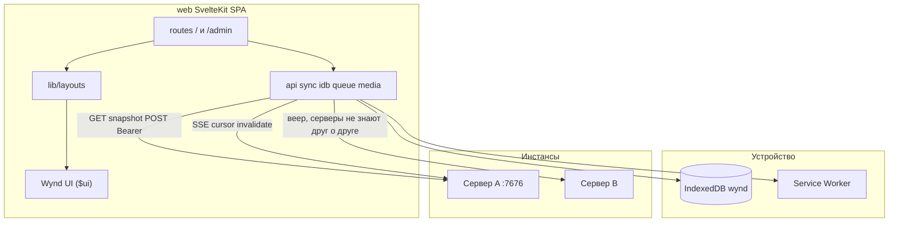
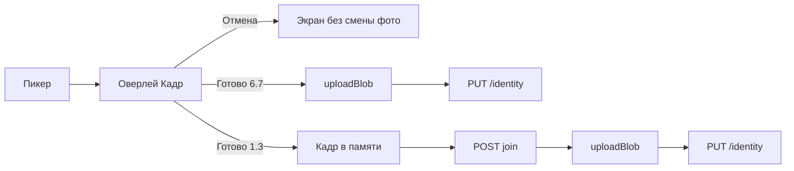

# Клиент — справочник

Решения клиента по темам и экранам. Формат — подзаголовок на тему или экран, абзац не длиннее 600 знаков, ячейка — 300 (CONTRIBUTING). Эталоны: [wynd.html](../wynd.html), [stack.html](../stack.html), [screens.html](../visual/screens.html).  
Компоненты и layout'ы: [ui-components.md](ui-components.md).

---

## Архитектура

Страницы не содержат `fetch` — только kernel + layout + компоненты.

**Дерево ядра:** `web/src/lib/api/`, `session/`, `idb/`, `sync/`, `queue/`, `media/`, `push/`, `format/`, `layouts/`.

`PhoneFrame` — корень layout'ов в бою (`app` и цвет круга). `StatusBar` — только в `/dev/*` и в layout'ах при `app={false}` (имитация кадра на десктопе). Макеты `screens.html` и образ `wynd.html` не синхронизировать с номером `VERSION`.

---

## Запрещено ставить

Tailwind, shadcn-svelte, axios, tanstack-query, Dexie, redux/zustand, date-fns/dayjs, tus/uppy, Mapbox, jsQR, Playwright как обязательность, adapter-node, SSR, Google Fonts CDN, `openapi-typescript` (типы API пишутся руками в `$lib`; почему — «OpenAPI» в справочнике сервера).

**Разрешено:** `idb`, `exifr`, `leaflet`, `leaflet.markercluster`, `@vite-pwa/sveltekit`, `vitest`, `fake-indexeddb`, `bits-ui` (только внутри `$ui`), `qrcode` (админ 9.2), `mediabunny` (клиентский encode видео, WebCodecs), `jsqr` (распознавание QR, где нет `BarcodeDetector`; подгружается лениво — 2.16, 2.17).

---

## Ключевые решения

### Чтение: снимки, не проектор

- Клиент **не** материализует хронику из `events[]`.
- Экран читает snapshot; SSE инвалидирует → повторный GET. Сервер SSE — опрос SQLite раз в 2 с, не LISTEN/NOTIFY.
- Первый кадр потока — `{"max_seq": N}` (`handleSyncFrame`): курсор в IDB больше N означает восстановленный из бэкапа сервер — курсор ставится в N, все снимки origin стираются, все `registerRefetch` этого origin дёргаются. Кадры без `seq` и без `max_seq` игнорируются.
- Очередь офлайна — оверлей с `.q` поверх снимка.
- Онлайн: POST → refetch. Без optimistic UI, кроме очереди.
- Транспортный сбой (`isTransportError`: не `ApiError` и не `AbortError`) на compose, полосе ленты и комментарии — в очередь, как офлайн; 4xx/5xx нет. После успешного открытия SSE — `drainQueue()` (события `online` может не быть, если браузер уже `onLine`).

### CSS-корень `.ph`

Семантика библиотеки внутри `.ph`. В бою: `
`.

- **Кнопки — сброс `:where(button)`,** а не зеркала. Один сброс нулевой весомости в начале `ui.css` снимает браузерные умолчания со всех `<button>`; классов-зеркал `button.X` рядом с `.X` больше нет, как и сторожа за их синхронностью.
- **Служебные классы — в конце `ui.css`.** Правило «экран — только `$ui`, без своих `<style>`» выдавливает вёрстку в `style="…"`. Вместо этого — короткие классы (`.mt-*`, `.mb-*`, `.gap-*`, `.flex`, `.flex-mid`, `.flex-top`, `.col`, `.note`, `.fine`, `.faint`, `.muted`, `.panel`, `.ttl`), объявленные последними: при равной весомости побеждает то, что ниже. Инлайн-стиль остаётся только там, где служебный класс не побеждает по весомости (`.adm h4`, `.cols > div`, `input.inp { font: inherit }` — все весом 0,1,1) или значение встречается один раз.
- **Храповик на инлайн-стили.** `web/scripts/inline-style-budget.json` хранит их число по экранам, `checkInlineStyleBudget` в `npm run check:ui` не даёт ему вырасти; стало меньше — сторож просит записать новое число. Так счётчик ходит только вниз. Считаются все три написания — `style="…"`, `style={…}` и `style:prop` (GUARD-2; при переходе бюджет семи экранов поднят до честного числа).
- **Как сверять правку CSS.** Поднять `vite dev` и живой сервер, снять до и после `getComputedStyle` со всех узлов экрана и сравнить. Экраны, которые перечитывают данные или сами себе меняют состояние (`/admin/check`, `/admin/access`), сравнивать двумя версиями подряд — переписанной против оригинала из HEAD, — и брать в снимок текст узла, чтобы отличить переверстку от смены данных. Ветки, которые на живом экране не поднять, сверять попарно: два одинаковых узла рядом, у одного старый `style=`, у другого новые классы.

### Состояние

- Svelte 5 runes в `*.svelte.ts`.
- Сессии — `session/session.svelte.ts`; тема `'system' | 'light' | 'dark'`.

### Хранилище IndexedDB — версии

База `wynd` в браузере; версия — `DB_VERSION` в `$lib/idb/db.ts`, подъём — в `upgrade`, по одной ступени на версию. Понизить версию браузер не даст: клиент старее базы её не откроет, и откат образа на такой клиент требует очистить данные сайта (писать в «Оператору» CHANGELOG).

| Версия | Выпуск | Что добавлено |
|---|---|---|
| 1 | 0.1.0 | `sessions`, `admin_session`, `cursors`, `snapshots`, `queue`, `media`, `pins`, `settings` |
| 2 | 0.4.0 | `groups` — группы кругов (2.10), только на устройстве |
| 3 | 0.10.0 | `media_meta` — размер и давность файла кэша для потолка (7.3); при подъёме заполняется по уже лежащему `media` (used 0 — вытесняется первым) |

Проверка подъёма — `media_migration.test.ts` (база v2 с кэшем → v3).

### Сеть

- `fetch` через `api/client.ts`, Bearer в `Authorization`.
- Сессии в IDB `sessions`; админ — `admin_session` только для `/api/v1/admin/*`.
- Медиа **не** через `` — только `objectUrl.ts` + кэш IDB.
  - Живые object URL держат не больше `URL_CACHE_MAX_BYTES` (256 МБ); сверх — отзывается давнее всех запрошенный. Показанная картинка остаётся, новый адрес экран берёт через `getMediaUrl` из IDB. Поэтому адрес медиа не кэшировать на экране дольше, чем живёт экран, и не передавать между экранами — только `blobId`.
  - Service worker — `generateSW` из `@vite-pwa/sveltekit`, `autoUpdate`: прекэш только собранных ассетов, `/api/` и блобы не кэшируются, на loopback не регистрируется. Ревизия `index.html` в прекэше — `VERSION+метка сборки`, не `VERSION`: иначе обновление из исходников без смены версии оставляло установленному PWA старую оболочку без её чанков (SW-1). Полную загрузку при переходе после обновления сервера делает сам SvelteKit (сверка `_app/version.json` при сбое узла) — своего кода для этого нет.
  - Кэш раздачи (`web/serve.go`): `_app/immutable/*` вне loopback — `public, max-age=31536000, immutable`; `index.html`, `sw.js`, `workbox-*`, манифест и прочий `_app/` — `no-cache`; на loopback `no-cache` на всём, потому что при локальной пересборке хеш бывает прежним (SW-2).
  - Ответ сети читается `res.blob()`; файл больше `IDB_MEDIA_MAX_BYTES` (20 МБ, обычно видео) в IDB не кладётся и при новом показе качается снова. Стримить с `Range` нельзя — `/blobs` требует Bearer, а `<video src>` заголовков не шлёт (план 42, MED-1).
  - Фото декодируется целиком, затем масштабируется (`createImageBitmap(file)`): пиковая память на 50-мегапиксельном снимке — ~200 МБ на секунду. `resizeWidth` при декодировании с ориентацией EXIF браузеры ведут по-разному, проверить можно только на повёрнутых снимках живых телефонов — не делаем (MED-3). Ориентация — браузерное умолчание `from-image` (в кадрировании — явно); `captured_at` — время снимка в поясе устройства, `OffsetTimeOriginal` не читается; знак GPS — из `exifr` (MED-4).
  - `theme-color` — в цвет фона темы: `#211E1C` в тёмной, `#F4F0E9` в светлой (`+layout.svelte`); цвет в манифесте один — он задаёт только заставку при запуске (SW-4).
- Адрес сервера на `/` и `/join`: дефолт `window.location.host`. `resolveServerOrigin` сводит к same-origin (`''`) только если `parsed === window.location.origin`; loopback с другим портом — другой сервер.
- Ссылки-приглашения: `parseWyndLink` принимает только ссылки на текущий origin — чужая ушла бы токеном на текущий сервер и осела в его логах; `/join` объясняет, что ссылку надо открыть на её сервере. Ссылка, которую создаёт участник, строится от `circle.origin`, не от хоста клиента (аудит 2026-09-22).
- Выход (`dropParticipantSession`) снимает push-подписку и стирает всё состояние сервера: сессию, курсор, снимки, очередь, кэш медиа, закрепления. Устройство могло сменить хозяина — неотправленная запись не должна уйти под чужой учёткой (аудит 2026-09-22).
- **Плитки карты — принятый риск (аудит 2026-09-22).** Карта грузит плитки с `tile.openstreetmap.org` (поддомены `{s}` сняты с осени 2023; атрибуция — ссылкой на `openstreetmap.org/copyright`, как требуют условия): третья сторона видит IP участника и район просматриваемых фото; `Referer` урезан до origin (`Referrer-Policy: strict-origin-when-cross-origin`). Свой прокси плиток — вне плана.
- Ключи `{#each}` не строятся из пользовательских данных (имена, текст): дубликат ключа бросает `each_key_duplicate` и роняет экран у всех читателей. Там, где список статичен, ключа нет; иначе — индекс.
- **Адрес исходников — от сервера.** `$lib/instance/source.svelte.ts` хранит `source_url` из `GET /instance` по origin (пустой ключ — сервер, отдавший клиент) и пополняется на каждом `fetchInstance`. Экраны берут адрес оттуда: «поднимите свой» на `/join` и `/circles/new`, «исходный код» в настройках и в футере `/admin`. Зашитый в клиент адрес — запас на случай сервера старой версии; по экранам его не разносить. Принимается только `http:`/`https:`: поле приходит и от чужого сервера (экран «Присоединиться» спрашивает `/instance` у любого адреса) и попадает в `href`, а `javascript:` оттуда исполнился бы на origin клиента (аудит 2026-09-27). То же правило — для любого нового поля с сервера, которое идёт в `href`, `src` или `{@html}`.
- **Лицензии компонентов** — ссылка на `/THIRD_PARTY_LICENSES.txt` рядом с «исходный код»; файл собирается скриптом, см. CONTRIBUTING.
- **Подсказка о почте.** `detail` у `smtp_failed` — метка причины (`dial`, `tls`, `starttls_required`, `auth`, `protocol`), а не текст релея; `smtpFailedHint` — таблица по меткам, без разбора строк.

### Загрузка

- Чанки API, **1 MiB**. EXIF через `exifr` → `entry_date`, `captured_at`.
- Аватар: клиентский кадр, JPEG 512×512 quality 0.85 (`media/crop.ts`). Не `compressImage` (лимит постов 2048).
- Видео: клиентский encode (`media/compress.ts` + `video-encode.ts`), WebCodecs через `mediabunny`. Пороги 9.7: короткая сторона ≤ `video_max_height` (1080p), битрейт `video_bitrate_kbps`. Выход — MP4 (H.264, если браузер умеет). Нет WebCodecs или срыв — файл как есть. Сервер ffmpeg не ставит.

### Кадр аватара (6.8)

Оверлей на весь экран, как Lightbox; не Sheet и не маршрут. Макет: [screens.html](../visual/screens.html)#e6-8. Тёмный экран только 4.14. `AvatarCrop` сам задаёт светлые `--paper` / `--ink`: иначе наследует `.ph.dark` с `PhoneFrame`.

- Окно круглое (как аватар в ленте). На диск — квадратный JPEG, совпадающий с кругом. Переключателя формы, поворота и фильтров нет.
- Оригинал после кадра не хранится. Сменить кадр — выбрать фото заново.
- **6.7:** пикер → оверлей → `uploadBlob` + `PUT /identity` только по «Готово». Оверлей не закрывать, пока upload и PUT не закончатся; «Готово» в `loading`; ошибка сети остаётся на кадре. Escape и «Отмена» во время upload не закрывают кадр. Имя: «Сохранить» — `PUT /identity` и уход в настройки; ошибка или пустое имя оставляют на 6.7.
- **1.3:** тот же оверлей; кадр в памяти; сначала `POST /invites/{token}/join` `{name, body?}`, потом upload + identity. Нет `avatar_blob_id` в join. Срыв фото после join не блокирует ленту: hint «Фото не загрузилось — поставьте в профиле» и вход в ленту.
- Поворот/ресайз вьюпорта: `clampCropTransform`, без сброса в центр. Tab циклически по «Отмена» и «Готово»; фокус не уходит на поля под оверлеем.
- Жесты: pinch — зум вокруг текущей середины двух касаний (вместе со сдвигом жеста); колесо — к курсору относительно вьюпорта. Затем `clampCropTransform`. Поворота снимка и фильтров нет.
- Код: `overlays/AvatarCrop.svelte`, `media/crop.ts`. Без cropper.js.

### SvelteKit

- `ssr: false`, `adapter-static`, `strict: false`.
- Dev: Vite proxy `/api` → `:7676`.

### UI

- Экран = layout + существующие компоненты Wynd UI. Новые `.svelte` в `$ui` в задаче экрана **не создавать**. Если из библиотеки не собрать — план `docs/plans/<slug>.plan.md` (пробел Wynd UI) и отдельная задача на библиотеку. Guard: `npm run check:ui`; сторож: `.cursor/hooks/ui-screens.mjs`. Форма плана: [ui-components.md](ui-components.md). Тексты — [голос](../wynd.html#voice): «вы», нейтрально; манифест «ты» в UI не копировать.
- Identity в `CircleBar` — `<button type="button" class="idn">`.
- **6.9** уведомления круга: полный набор кадра — `posts`, `comments_mine`, `comments_all`, `reactions`, `events`, `mute_until` (Нет / До завтра / На неделю); «Упоминания» — disabled `Switch checked={true}`, без persist; mention пробивает mute. Пуш `mention` при создании записи и комментария.
- **7.3** Потолок кэша медиа — `AppSettings.media_cache_bytes`, по умолчанию 2 ГБ (`MEDIA_CACHE_DEFAULT_BYTES`); чипы 1/2/5 ГБ и «Своё» до 100. IDB v3: `media_meta` (размер, давность) рядом с `media`; `putMedia` пишет оба, `getMedia` освежает давность, `trimMediaStore` после записи (раз в 2 с) вытесняет давно не открытое до 90% потолка; размер кэша — по метаданным. Старый кэш получает метаданные при подъёме версии (used 0 — уходит первым). Свободного места на диске не показываем: `storage.estimate().quota` — отведённое сайту (Firefox ≈ 10 ГБ), не диск; потолок выше квоты — подсказка «больше кэш не вырастет». `/settings/app`: только три умолчания — новые записи, комментарии к моим, реакции. Hint: круги без отдельных уведомлений и будущие вступления; круги с сохранённой 6.9 не меняются. При сохранении `PUT /notify_prefs` ещё шлёт `comments_all: false`, `events: false`, `mute_until: null`. Упоминаний на 7.3 нет (на 6.9 они «всегда»). IDB `notify_defaults` — эти три поля. Архив, identity, servers, deadlines — тоже `SettingsRow`, не сырой `.row2`.
- Круг без доступа — `PlainLayout`, не сырой `
`.
- Список реакций — `OverlayLayout.ondismiss` (Scrim), без второго клик-слоя. Токены знака и пустой ленты: `--mark-w` / `--mark-h` / `--empty-ink`.
- Compose и правка — `/circles/[id]/compose?post=`. `TextArea variant="compose"`: зеркало + `.men` красит `@имя` при наборе; поле `color:transparent`, placeholder через `::placeholder`. Футер 4.2/4.9: `IconButton` photo и file; в правке те же кнопки, PATCH с итоговым `media[]`, крестик на плитке (`MediaTile` `onremove`).
  - Правка копирует `captured_at` / `geo_*` с уже лежащих вложений; гео новых снимков — только из EXIF (`readExif` → `QueueMediaMeta.geo_*`, на сервер с `post_media`); кнопки места нет, post-level `geo_lat`/`geo_lng` compose не пишет. Loc нет в полосе комментария 4.5/4.6.
  - «Отнести к дате» в правке та же, что на 4.2: день можно сменить, пока живо окно. Строка «Правится до…» в правке всегда; подпись про расхождение окон — только если окно записи разошлось с кругом.
  - Видео сжимается на клиенте при выборе (пороги 9.7); hint «Сжимаем видео…» и для длинного — «Не сворачивайте приложение…»; «Опубликовать» погашен, пока идёт сжатие.
- Лента 3.3 / 3.6 — оболочка на «вы»: пустой круг «Пока ничего» / «Напишите первым — или позовите тех, с кем хотите это вести.»; отрезок «Вы здесь с {visible_from}», hint «что было раньше — не ваше», «круг живёт с {circle_started_at}» (с годом). 3.4 «Здесь начинается круг» не трогать. Манифест «ты» в UI не копировать.
- Группы кругов (2.10) и пины — только IDB, без API. Круг в одной группе; закреплённый круг стоит дважды — в «Закреплённых» и в своей папке (закрепление — ярлык сверху, не переезд); меню удержания открывается у той строки, которую держали (`menuKey`: раздел + круг). Удержание 500 мс на карточке — закрепление и чипы папок; удержание заголовка папки — переименовать / удалить. Чипы папок второй строкой `CircleRow` в режиме `card`. Удержание плюса (2.11) — меню над FAB: «Новый круг» (`openNewFromMenu`), «Новая группа», «Присоединиться» (→ `/invite`, 2.16). Тап мимо любого открытого меню закрывает его (`onWindowPointerDown`, вне `.fab-wrap` / `.circle-row-card`) и ставит отметку поглощённого жеста — тот же тап не открывает круг; `pointerup`/`pointercancel` плюса снимают `suppressClick` в `queueMicrotask`, чтобы клик того же жеста не уводил на «Новый круг», а следующий тап — да.

### Панель

Эталон: [screens.html](../visual/screens.html) `#e9-1`–`#e9-10`.

- Нав: Проверка, **Общие**, Доступ, Люди, Хранилище, Сжатие, **Оплата**. **9.10** `/admin/general`: пароль панели (`PUT /admin/password`), имя и `public_url` (`GET/PUT /admin/access`), почта и проверочное письмо (`GET/PUT /admin/smtp`, `POST /admin/smtp/test`). `/admin/smtp` редиректит сюда. Кадры 9.1–9.10 без пункта «Оплата»: это другие разделы панели.
- **9.7** `/admin/compress`: «Формат и качество» WebP q; видео в `p` и Мбит/с (в API — px / kbps); потолок вложения в МБ → `attachment_max_bytes`. Эти пороги клиент применяет при выборе файла (фото — WebP, видео — MP4). Аватар 6.8 — JPEG (`crop.ts`).
- **9.1** `/admin/bootstrap`: пароль админа первой карточкой — единственное обязательное поле. Имя и `public_url` можно пустыми (имя и адрес — позже на 9.10). При открытии по `https://` адрес подставлен из `location.origin` (по `http://` — нет: локальный запуск с телефона по LAN-IP вышел бы из профиля loopback). SMTP как 9.10 — вторым рядом, необязательна при любом адресе; начатый, но неполный релей — ошибка над кнопкой, не молчаливый пропуск. Ошибка стоит над кнопкой, страница прокручивается к ней. Кнопка «Проверить подключение» — `POST /admin/bootstrap/smtp-test` (токен bootstrap, поля релея, без сохранения). Проверочное письмо при сохранении — на envelope-адрес «От кого», в том числе на loopback, если релей задан. Caddy — `install.sh`, не форма.
- **9.8** Строка «Тестовый пуш» → «Отправить»: `Notification.requestPermission()` первым шагом (жест пользователя), подписка этого браузера (`browserPushSubscription`) уходит телом `POST /admin/push/test` и не хранится. Проверка PWA берёт манифест из корня сайта, не через `apiPath`. В `ExternalReport` — `probe_instance` из `GET /probe` и `page_host` (`location.hostname`) для строки «Домен».
- **9.8** `runChecks()` шлёт браузерный `ExternalReport` (`collectExternalReport`, `GET/PUT /api/v1/probe*`, PWA/manifest). Заголовок считает только `fail`, не `warn`. Размер тела — `body_probe_bytes` из `GET /probe` (`min(attachment_max_bytes, 2 МБ)`), не весь потолок вложения. Длинная отдача — `GET /probe/stream`; строка «Таймаут» из `runChecks` (`proxy_read_timeout_sec`), не заглушка «300 с» в UI. «Отправить» у тестового пуша обновляет строку и перезапускает проверки.
  - HTTP→HTTPS 301/308 считает сервер (`ProbeHTTPRedirect`), в строке — фактический код. DNS, TLS и цепочка — `internal/check` (`ProbeTLS`, резолв домена); Let’s Encrypt — Organization или CN `R\d+`/`E\d+`. `GET /probe` отдаёт `client_ip`, `x_forwarded_for`, `x_real_ip`.
  - Почта — одна строка `mail`: ушло / не ушло / ещё не отправлялось (`smtp_test_sent_at`, `smtp_last_error`); DKIM нет. Бэкап — копия `wynd backup <каталог>`. VAPID — «Скачать копию».
- **9.10** `/admin/general`: смена пароля (текущий + новый), имя, адрес (`public_url` в `config.json`, `Auth`/`Mail` loopback без рестарта), релей и проверочное письмо.
- **9.9** `/admin/fix?fail=`: заголовок поломки, чипы probe, `CodeBlock` `lines[]` с `.hi` / `.cmt` (`  # …`); сниппет прокси от `attachment_max_bytes`. Caddy, Traefik и Apache — те же клиентские заголовки и read timeout, что nginx (`X-Real-IP` / `X-Forwarded-For` / `X-Forwarded-Proto`, 300 с).
- **9.5** потолок инстанса: поле ГБ **или** `%` диска, не оба; плейсхолдеры `40` / `80` (суффиксы «ГБ» и «% диска» снаружи), неактивное поле пустое. Hint под строкой: действует одно, сохранение очищает другое, при упоре текст пишется, медиа — нет. Заводское умолчание — **80% диска** (миграция 0009), не 100 ГБ абсолютом.
  - Чипы умолчания круга: Нет / 5 ГБ / 10 ГБ / Своё. 5 и 10 = `n * 1024^3`. Своё: целое 1…1024 ГБ. Таблица: custom=0 — эффективное без «своя»; custom=1 и null — `без квоты · своя`; custom=1 и число — `{N ГБ}` + faint `своя`. Строка → `/admin?circle={id}`; повторный тап снимает query.
- **9.6** на том же `/admin`, не новый маршрут. При `?circle=` блок «Просят больше» скрыт. Чипы: «Как умолчание · …»; pending — `{requested} ГБ` (абсолют); «Без квоты». «Дать» только навигирует на карточку, не `POST .../approve`. «Отказать» — текущий reject. Кнопки `.btn` / `.btn.gh`, не `.act`.
- **9.2** QR `qrcode` SVG в `.qr` в правой колонке, подпись «та же ссылка кодом». Чипы — общий `$lib/circles/invite-options` с 2.7: одноразовая / 5 / 10 / «Без ограничений» / «Своё» (1–1000); срок — час / 72 часа / неделя / месяц / «Без срока» / «Своё» (1–365 дней). «Без ограничений» и «Без срока» — только здесь (`unlimited_uses`, `no_expiry`); в «Живых» — словами, не отметками. Колонки учёток нет. Под формой — блок «Живые» (`GET/DELETE /admin/invites`, `revokeInvite`). Заход на экран ссылку не выпускает: есть живая — показывается свежая (чипы по её виду и сроку), нет — выпускается одна. Смена чипов отзывает показанную ссылку и выпускает новую.
- **9.3** `/admin/people`: клиентский `email.includes`, без API. Фильтр почты — `SearchField` (поле фильтра = поиск). `blocked` → «вход закрыт» во второй колонке рядом с числом. `circle_count===0` → «без кругов», не фильтровать.
- **9.4** `/admin/people/{id}` — только `GET /admin/accounts/{id}`. «последний код» только если `last_login_at`. В строке круга роль и `joined_at` → «участник · с {дата}». Владелец круга — кнопки удаления нет. Второго диалога нет.

---

## IDB `wynd` v2

| Store | Key | Содержимое |
|-------|-----|------------|
| `sessions` | `origin` | `{ origin, name, email, token, account_id, signed_in_at? }` — `signed_in_at` ISO при `persistSession` (логин / код); старые записи без поля |
| `admin_session` | `'admin'` | `{ origin, token }` |
| `cursors` | `origin` | `{ origin, seq }` |
| `snapshots` | `${origin}:${kind}:${id}` | JSON + `fetched_at` |
| `queue` | autoincrement | `{ type, origin, circle_id, client_id?, attempts?, uploading_at?, payload, files[], state, uploads?, error?, created_at }`; стирается при выходе с origin (`clearOriginState`) |
| `media` | `${origin}:${blob_id}` | ArrayBuffer + mime |
| `pins` | `${origin}:${circle_id}` | pin row |
| `groups` | `id` | `{ id, name, circleIds[], collapsed }` |
| `settings` | `'app'` | `{ theme, notify_defaults, circle_meta?, day_prompt_seen?, day_prompt_count? }` |

---

## Маршруты

Эталон — [screens.html](../visual/screens.html). Таблица — оглавление; что решено на экране — в подразделе ниже.

| Путь | Кадры | Подраздел |
|------|-------|-----------|
| `/`, `/invite/[token]`, `/join`, `/join/[token]`, `/auth/code`, `/circles/[id]/join` | 1.1–1.8 | Вход |
| `/circles`, `/circles/new`, `/circles/new/server` | 2.* | Улочка |
| `/invite` | 2.16 | Улочка |
| `/invite/scan` | 2.17 | Улочка |
| `/search` | 2.*, 5.7 | Улочка, Поиск |
| `/circles/[id]` | 3.* | Лента |
| `/circles/[id]/days`, `.../days/[date]`, `.../days/[date]/album` | 5.1–5.3 | Дни |
| `/circles/[id]/grid`, `.../map`, `.../search` | 5.5–5.7 | Сетка, карта, поиск |
| `/circles/[id]/compose` | 4.2, 4.9 | Compose |
| `/circles/[id]/posts/[postId]`, `.../album` | 4.5, 4.13, 4.8 | Запись |
| `/circles/[id]/settings` … `/archive` | 6.* | Настройки круга |
| `/settings`, `/settings/servers`, `/settings/app` | 7.1–7.3 | Настройки приложения |
| `/pay`, `/pay/extend`, `/pay/help` | 10.3 / 10.8 / 10.6 | Оплата |
| `/admin` | 9.5–9.6 хранилище (`?circle=`) | Панель (выше) |
| `/admin/check` | 9.8 | Панель |
| `/admin/compress` | 9.7 | Панель |
| `/admin/access` | 9.2 | Панель |
| `/admin/people`, `/admin/people/[id]` | 9.3–9.4 | Панель |
| `/admin/general` | 9.10; `/admin/smtp` → сюда | Панель |
| `/admin/pay` … `/donate` `/subscription` `/requests/[id]` `/accounts/[id]` | 10.10 / 10.13 / 10.11–10.14 / 10.12 / 10.15 | Оплата |

Не маршруты: Sheet 4.12 — `?reactions={postId}` на ленте; оверлей 6.8 «Кадр» — как Lightbox. Список реакций — `OverlayLayout.ondismiss` (Scrim), без второго клик-слоя.

### Вход

- **`/` (1.5):** тот же `Input` «Адрес сервера», что на `/join`; дефолт `window.location.host`; `fetchInstance(resolved)`, не `''`; почта — `isValidParticipantEmail` до POST.
- **`/invite/[token]` (1.1):** та же проверка почты до POST.
- **`/join`, `/join/[token]` (1.6–1.8):** 1.7 — `GET /invites/{token}` без круга, карточка сервера, подпись `host · позвал {имя}`; дефолт адреса на `/join` — `window.location.host`.
- **`/auth/code` (1.2):** `code_delivery=log` — заголовок «Код с сервера», без пути лога; `mail` — «Код из письма»; 429 — Hint со сроком, кнопка повтора disabled на `retry_after_sec`; назад / «изменить адрес» — на форму входа, `/join`, `/join/{token}` или `/invite/{token}`.
- **`/circles/[id]/join` (1.3–1.4):** форма имени при ссылке **или** личном инвайте (`GET …/join-preview`, `POST …/join`); `?members=1` не сбрасывает черновик; после join `identity_name` в шапке, `setCircleColor` его не затирает.

### Улочка

- **Новый круг:** одна `ServerRow` с шевроном на 2.5 (не `/settings/servers`), выбор в layout `NEW_CIRCLE_CTX` и `?origin=`; шеврон не прячется при одной учётке.
- **Приглашение (2.16, `/invite`):** «У меня есть приглашение» с 2.3. Поле ссылки: вставка сразу ведёт по `parseWyndLink` на `/invite/…` или `/join/…`, «Открыть» — для набранной; «Сканировать QR-код» → `/invite/scan` (2.17): `getUserMedia` задней камерой, кадр раз в 250 мс в `decodeQrFrom` — `BarcodeDetector`, где есть, иначе `jsQR` (подгружается лениво; кадр ужат до 640 px); код своего сервера сразу открывает приглашение, чужой — строка вместо подсказки, камера не гаснет. «Фото с QR-кодом» — `decodeQrFromFile`, тот же разбор. Один разбор текста — `inviteTarget`. Чужой сервер — `foreignWyndLinkOrigin`, отказ «откройте её там» (токен не уходит на этот сервер).
- **Обновление улочки жестом (3.5):** обёртка `.street-list` во всю высоту `.shell-body` с `pullToRefresh`, верх списка — `scrollTop` у `.shell-body` (`overscroll-behavior-y: contain`, иначе жест забирал Firefox); отпустил — `refresh()`.
- **Пустая улочка (2.3):** «Ни одного круга», подсказка и кнопки сверху; ниже — «Как устроен Wynd»: пять `SettingsRow` без стрелки (`streetFacts`: круги вместо ленты, своё имя, видно застанное, посторонних нет, где лежат данные — с адресом сервера сессии). Только пока кругов нет: объяснить некому (исключение из «не тур по приложению», `wynd.html`).
- **Поиск с улочки (`/search`)** — поле `SearchField autofocus` в шапке (`FormLayout bar`), как на 2.9, второго поля в теле нет; в круге то же `autofocus` в `CircleBar`. Всегда все круги, без «Этот круг / Все круги»; дни со словом «день», ключ круга режется с `lastIndexOf(':')`; чипы «Период / С фото / С местом»; `?q=`, период, фото и место переносятся на `/circles/[id]/search`.
  - Авторы круга — `GET …/search/authors`, не из 50 попаданий. Сбой части инстансов на `/search` — Hint **над** группами, не вместо списка (в круге один origin: ошибка вместо списка).
- **Приглашения и полка:** улочка подмешивает `GET /pending-circle-joins` (строка «Вас позвали — выберите имя» → `/join`); `left_with_access` на полке — превью «читает, не пишет», без badge (2.15).

### Лента

- **Прочитанное:** `lastReadSeq` фиксируется при входе, черта пересчитывается после загрузки; прочитанное — при уходе.
- **Шапка и события:** иконка поиска в `CircleBar` → `/circles/[id]/search`; 3.3/3.6 на «вы»; служебные `.ev` новее верхнего поста и при пустой ленте (`serviceEventsAboveNewest`); `author_avatar_blob_id` у всех авторов, не только «я».
- **Отсечка архива:** запись до отсечки активного цикла — без плюса реакций, Hint под карточкой.
- **Читатель:** `CircleContext.canWrite` — при `left_with_access` hint 3.9, без `CommentBar` и без `+` реакций, имя в шапке не ведёт в настройки; layout пускает читателя, не join/403. На дне нет «нажмите, чтобы изменить», надписи «сменить» на обложке, входа в выбор обложки и пояснения «День общий…»; в пустой ленте — только «Пока ничего», без призыва писать и «Пригласить»; экраны, которые только пишут (compose, альбом дня, своё имя в круге), по прямому адресу возвращают читателя назад с `replaceState` (SCR-2).
- **Смена параметра маршрута** (SCR-1). SvelteKit не пересоздаёт `+layout`/`+page` при смене одного параметра. Макет круга перечитывает мета по `$effect` на `circleId`, а дочерние экраны оборачивает `{#key $page.url.pathname}`: другая запись, другой день, другой круг — новый экран с `onMount`. Экран под `[id]` может грузить данные в `onMount`; смена только query его не пересоздаёт.

### Дни

- **Список и день (5.1–5.3):** имя на месте; подпись дня «{дата} · нажмите, чтобы изменить»; `Avatar src` на карточке дня — `author_avatar_blob_id`, как в ленте.
- **Обложка дня (`/circles/[id]/days/[date]/album`):** «убрать обложку», пока живо окно и есть своя запись за день.

### Сетка, карта, поиск

- **Поиск 5.7** — `SearchField` в цветной шапке (`.sfield.inv`), чипы «Этот круг» / «Все круги» (`/search?q=` без автора); второй ряд: Период / С фото / С местом / автор (чипы автора только если авторов больше одного).
  - Чип автора — query `author=` (то же значение, что у чипа и у API; пустой чип — параметра нет); `popstate` читает `author` так же, как `photo` / `location`.
  - Запрос и чипы в URL (`replaceState`), назад не сбрасывает поле; назад с поиска — в круг, не на улочку. Превью — `thumb_blob_id` в `SearchResultRow` (круг и все круги).
- **Карта 5.6** — лист: 74px, автор, время, тело; тап по листу открывает запись (строки «Открыть запись» нет); `MapPin.author_name` / `body` из снимка `/map`.

### Compose

- **4.2, 4.9 (`?post=`):** `@` — `MemberRow` в карточке, в ленте и в поле `.men` без ссылки; правка — полный `media[]` на PATCH, с `captured_at`/`geo_*` уже лежащих вложений.
- **Сбой и права:** транспортный сбой публикации — очередь, без Hint «Не удалось выполнить запрос»; `canWrite=false` (в т.ч. `?post=` и `?queue=`) — `goto` ленты круга с `replaceState` (hint 3.9 уже там).

### Запись

- **4.5, 4.13, 4.8:** `@` в комментарии открывает picker; очередь офлайн-комментария — `.cmt.q`; `CommentRow src` — `author_avatar_blob_id` любого автора, не только «я»; заблокированная запись — без полосы, Hint как на ленте.
- **Альбом и лайтбокс:** альбом — «N фотографий», автор · время в шапке; лайтбокс — `IconButton` «Скачать» для фото и ролика (имя — `filename` с медиа или `photo-{n}.jpg` / `video-{n}.mp4`); вложения в лайтбоксе нет.

### Настройки круга

- **Приглашения:** `invite?from=create` — 2.7: круг уже создан, поэтому «назад», «Сначала в круг» и «Готово» на 2.8 — все в ленту круга; «Позвать из других кругов» на 2.7/6.5, если `invite-candidates` не пуст → `/settings/invite/from` (2.8), `from=create` сохраняется. На 2.8 справа в шапке «Готово» — сразу в ленту круга (`FormLayout right` + `onright`; с обработчиком `BackBar` рисует `.rt.done` кнопкой); «назад» — на 2.7 или в настройки.
  - `invite_kind_default=single` — без чипа вида и лимита 5/10/25, создание всегда одноразовая 72 ч даже при `multi`; живые ссылки — 6.21 `/settings/invites`, пункт на 6.1, не блок на 6.5/2.7.
- **Квота:** запрос — `/quota/request`, чипы как 9.5 без «Нет», не POST текущего потолка; на `/quota` «Попросить у администратора» при любой заданной квоте, не только когда место кончилось; `/quota` без потолка — «ограничение не задано».
  - Хаб при квоте и цикле — `/quota` рядом со сроками и скачиванием; drag отсечки не снимает график; `/quota/deadlines` заполняет даты цикла до первой отрисовки; архив 6.14 — «N файлов · объём» и «N записей…» из `archive_cycle`.
- **Соло и уход:** соло — без «Передать владение», «Покинуть круг», чипов «Могут все / Только владелец» и без чужих уведомлений; `/leave` у владельца с кем передать — 6.19.
- **Удаление круга** — диалог на 6.2 (`?delete=1`), цифры из quota/members, набор **сохранённого** имени; `/settings/delete` редиректит.
- **Ввод:** пустое название/имя и часы вне 1…8760 — Hint, без PATCH.

### Настройки приложения

- **7.1–7.3:** 7.2 подпись `{N} кругов · вошли {дата}` из `signed_in_at` (локальный день; без поля — только число кругов); 7.3 — три переключателя, кэш, тема, `Wynd {VERSION} · AGPL-3.0`; тема на 7.3 из `getAppSettings()`, не `getTheme()` до `initSession`.

### Оплата

- **Шлюз** — layout `/circles` и `/search` **и** API кругов (`payment_required`, 403), когда `required && expired && has_requisites`. 403 с этим кодом не сбрасывает сессию. Без `expires_at` — 10.2 «Подписки на «{имя}» ещё не было…»; с датой — 10.1 «закончилась {дата}».
- **Реквизиты и заявка:** без реквизитов заявку и баннер не показывать. Скриншот обязателен для заявки участника. `/pay` и `/pay/extend` при pending уводят на улочку (баннер 10.9 или шлюз 10.4), форма не мелькает.
- **Баннеры:** на пустой улочке те же, что на непустой; напоминание не рисуется, пока висит pending.
- **Срок:** продление `max(now, expires_at)+days` (бессрочная текущая считается от сегодня). Бессрочно в UI — префикс `9999-12-31`, пустой срок ≠ бессрочно.
- **Панель оплаты:** 10.14 таблица «На сервере» и 10.15 `/admin/pay/accounts/[id]` только при включённом шлюзе; прямой URL 10.15 уводит на `/admin/pay/subscription`. Выдача срока — «Бессрочно» или дни (`PUT {days|unlimited}`); `GET/PUT /admin/pay/accounts` при выключенном шлюзе — ошибка. 10.12: «подписки не было», чип «Бессрочно».
- **9.4 и подписка:** на 9.4 строка подписки при включённом шлюзе («до…» / «не было» / «бессрочно» / истекла) → 10.15, срок на 9.4 не правят.

### Полоса, комментарии, реакции

- **Лента 3.1/4.1:** `CommentBar` в `CircleLayout` — шеврон и фото при `onCommentCompose`, отправка с полосы через `onCommentSend`; на compose 4.2 с черновиком в `sessionStorage` ведут только шеврон и фото; касание поля ставит курсор и на телефоне, и на ПК — запись пишется прямо в полосе (4.1). Enter — перенос строки. `.send:disabled`, пока пусто; `.f.ink`, когда можно отправить. Поле — `TextArea variant="comment"` (класс `.inp`). Превью комментария в ленте — имя, тело и `formatPostTime`.
- **Черновик compose.** Текст новой записи сохраняется в `sessionStorage` (`wynd.compose.<circle>`) при каждом изменении и восстанавливается при открытии compose — вкладка, выгруженная телефоном, пока открыта камера, текст не теряет. Стирается после публикации или постановки в очередь; «Назад» его оставляет. Правка опубликованной или отложенной записи черновик не трогает. Вложения не сохраняются (SCR-3). Вложение больше `attachment_max_bytes` после сжатия во вложения не попадает — подсказка с именами файлов (MED-5).
- **Комментарий:** тот же `CommentBar` без `oncompose` (нет фото и шеврона); placeholder «Написать комментарий…»; Enter — перенос строки, не отправка.
- **Обсуждение 4.5/4.6–4.7/4.8:** `CircleLayout` `tabs={false}`; нить `.thread` / `.cmt`; время реплики — `formatClock`; правка комментария на месте (`.ced`, имя и часы остаются, карандаш и корзина прячутся). Аватар реплики — `author_avatar_blob_id` из фида (`commentResponse` + `IdentityAvatarBlobIDs`); лица в реакциях нет.
  - Своя запись, пока живо окно: карандаш (`IconButton` `edit`) в шапке карточки, справа перед обложкой, ведёт на 4.9. Превью комментариев — `CommentPreview` (`button.cm`), сосед `PostCard`, не внутри карточки. Удалить комментарий — без диалога, строки в хронике нет. Запись до отсечки активного цикла: `commentBar={false}`, плюс реакций скрыт, Hint «Эта запись уйдёт с сервера…».
- **Реакции 4.10–4.11:** в API и очереди только ключи `heart` | `laugh` | `surprise` | `anger`; на экране — `ReactionBar` (`.rx` / `.rxpick`). Плюс открывает пикер в карточке и не ставит реакцию сам; неизвестное в БД рисуется как сердце. Плюс гаснет в соло, когда окно своей реакции вышло, и на заблокированной архивом записи. `groupReactions` / `pickReaction` / `togglePicker` / `?reactions=` — на маршруте, не в `$ui`. Sheet 4.12 — `ReactionListRow`, список имён, без пикера.
- **Имя в круге:** шапка, compose и профиль — `detail.identity_name`, иначе IDB, иначе кусок почты; после детали — `setCircleIdentity`.

---

## Локальный прогон

`go run ./cmd/wynd` и `cd web && npm run dev` (Vite :5173, proxy `/api` → :7676).

**Здесь закрывается:** инвайт → круг → запись → лента у второго → офлайн-черновик → дни/сетка/поиск → `/admin`.

**Здесь не закрывается:** камера, PWA installability, Web Push, TWA, LAN без HTTPS.

---

## Вне scope

TWA, миграция круга, PostgreSQL, UnifiedPush, GDPR-экран, QR-сканер как требование приёмки.
