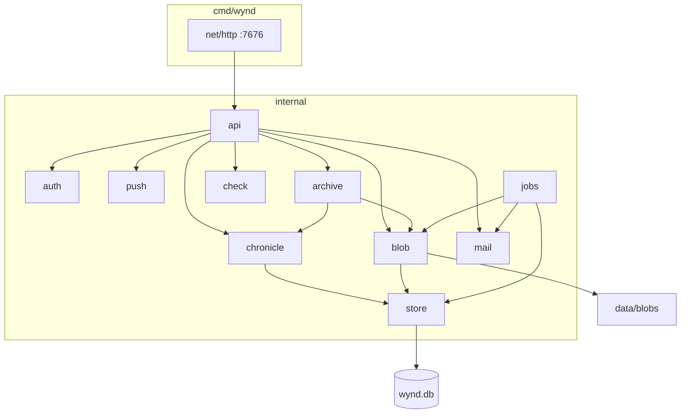

# Серверный слой — справочник

Сжатая выжимка из закрытого плана реализации. Эталоны: [wynd.html](../wynd.html), [stack.html](../stack.html), [screens.html](../visual/screens.html).  
Продуктовые правила: [журнал](../wynd.html#journal), [дни](../wynd.html#days), [квота](../wynd.html#quota), [серверы](../wynd.html#servers).

---

## Архитектура

---

## Ключевые решения

Зафиксировать в коде, не пересматривать по ходу.

- **Термин `circle` везде** в коде и JSON (`circle_id`, не `group`/`space`).
- **Идентификаторы — UUID v7.** Курсор sync — монотонный `seq` внутри инстанса.
- **Аккаунт ≠ идентичность.** Аккаунт: почта на этом сервере. Идентичность: имя и лицо в одном круге, версионна. Admin API не отдаёт связку «один email — несколько лиц».
- **У инстанса есть имя.** Короткая строка («Дом Ани»); задаётся при первом запуске. Идентификатор сервера — адрес.
- **Учётка двумя путями:** приглашение в круг или регистрация без круга. Режим инстанса: `open` | `invite` (умолч.) | `closed`.
- **Сервер не знает о других серверах.** Миграция круга между инстансами — не реализована; UUID заложены.
- **Хроника — источник sync, снимок — источник чтения.** Одна SQLite-транзакция: событие + проекция.
- **Журнал — сказанное и структура.** Подробнее — [образ, журнал](../wynd.html#journal).
- **Отрезки видимости** — интервалы `[started_at, ended_at)` на пару (account, circle). Повторный вход — новый интервал.
- **Окно правок** — параметр круга (0 = летопись). У каждой единицы сказанного своё окно; смена параметра действует только вперёд.
- **Три времени записи:** `created_at` (sync, лента), `entry_date` (отнесение, правится в окне), `captured_at` (EXIF, справочно).
- **День — проекция** `(circle_id, entry_date)`. Название и обложка — сказанное.
- **Цикл архивации по квоте** — событие круга. `cutoff_locked_at` при первом скачивании архива.
- **Сессии участников — Bearer.** Админ — отдельная сессия, журнал через неё недоступен.
- **SQLite** через `modernc.org/sqlite`. WAL, `busy_timeout`, `foreign_keys`. Один процесс на файл БД; второй на том же `wynd.db` вне модели. Пул `SetMaxOpenConns(1)` не ставим. Интерфейс `store.Store` — Open/Close/Ping/Version; драйвер один.
- **Миграции.** Один baseline `0001_schema.sql` (схема v1); следующая — `0002_*.sql`. Старый `wynd.db` с версией > 1 — удалить.
- **Список кругов аккаунта.** `ListAccountCircles` — три batch-запроса (курсоры, unread постов, последнее видимое событие), не N+1 на круг. Видимость — `sqlVisibleAtMembership`.
- **Время в БД** — `RFC3339Nano` (`internal/xtime`). JSON снаружи может остаться секундами (`RFC3339`).
- **Снимок ленты/сетки** — потолок `chronicle.SnapshotPostLimit` (2000 постов). Круг больше — вне модели, не пагинация API.
- **SSE** — опрос SQLite раз в 2 с, без LISTEN/NOTIFY.
- **Liveness / ready.** `GET /health` — процесс жив. `GET /ready` — `Ping` SQLite.
- **Бэкап** — `VACUUM INTO`, не копия голого `wynd.db` при WAL.
- **HTTP — stdlib**, порт **7676**.
- **Push notify.** `notifyCircle` логирует ошибки членства, prefs и `SendSignal`. Горутина — 10 с; `WaitNotify` после `http.Server.Shutdown` (тот же ctx, 10 с).
- **SMTP / VAPID не настроены.** `mail.ErrNotConfigured` / `push.ErrNotConfigured` → 400 `smtp_not_configured` / `push_not_configured`, не 500. Ошибка JSON encode и немаппленный domain-error — в лог.
- **Имя файла блоба.** `sanitizeFilename` обрезает по рунам (255), не по байтам.
- **Блобы** — без ffmpeg. SVG и HTML всегда `Content-Disposition: attachment`.
- **Код на английском**, строки писем и пушей — на русском.
- **Квота круга.** `instance_settings.default_circle_quota_bytes` (`NULL` = нет потолка круга). `circles.quota_custom`: 0 → умолчание инстанса; 1 → `circles.quota_bytes` (`NULL` = без квоты). Смена умолчания круги не UPDATE-ит. `PUT /admin/storage/default_quota` не смешивать с `PUT /admin/storage/quota`. `PUT /admin/circles/{id}/quota` `{custom, quota_bytes?}`: `custom=false` игнор тела; `custom=true` + число — своя; без числа — без квоты. Ниже `media_bytes` и выше потолка инстанса ставить можно. Событие хроники не писать. Pending при PUT: `approved` + `resolved_at` (абсолют). `POST .../approve` ставит `quota_custom=1` и `quota_bytes = requested` (абсолют); UI «Дать» зовёт `PUT .../quota`, не approve.
- **Учётка в панели.** `GET /admin/accounts` без `deleted_at`; `circle_count` — только `memberships.status='active'`. `GET /admin/accounts/{id}`: `{id,email,created_at,last_login_at,blocked,owns_circle,circles:[]}` — лица нет, `circles` всегда массив, `joined_at` из `memberships.created_at`. `last_login_at` — только после успешного participant-кода. `DELETE /admin/accounts/{id}` — soft-delete, не `DELETE FROM accounts` (blobs `ON DELETE CASCADE`): владелец круга → 409; sentinel → 404; `LeaveInTx` (Gone) и soft-delete в **одной** транзакции; `identities.account_id` NULL (`UNIQUE (circle_id, account_id)` тогда допускает несколько отвязанных лиц на круг — SQLite NULL ≠ NULL); `deleted_at`, `blocked=1`, email `deleted+{id}@wynd.local`; сессии как при block. Повторная регистрация той же почты — новый account. Записи и хронику не трогать. `jobs.cleanEmptyAccounts` — тот же soft-delete, не `DELETE FROM accounts`.
- **Реакции.** В API только ключи `heart` | `laugh` | `surprise` | `anger`; иначе `ErrInvalid`. Миграции старых эмодзи нет. `reactionResponse` несёт окно правок. `DELETE .../posts/{post_id}/reactions` ищет свою реакцию на пост, затем `DeleteReaction` по id.
- **Серверный инвайт.** `createInviteBody.ttl_sec`; иначе неделя. Инвайт круга — `ttl_sec`; иначе 3 дня.

---

## Локальный прогон

**Loopback:** host `public_url` — `127.0.0.1`, `localhost`, `::1`. Каталог данных — `dev/data`.

**Поднять:** `go run ./cmd/wynd`. Smoke: `curl http://127.0.0.1:7676/health`.

**На loopback:** bootstrap без SMTP; код входа в лог без релея; `GET /api/v1/instance` отличает закрытый сервер от сломанного; HTTPS/прокси/«снаружи» — «не применимо», не FAIL.

**Здесь закрывается:** хроника, auth, журнал, sync/SSE, поиск, admin API, квота и архив, `go test ./...`.

**Здесь не закрывается:** Let's Encrypt, прокси-заголовки, Web Push на localhost, systemd. `http://192.168.x.x` — не loopback-профиль.

---

## Инварианты для тестов (хроника)

- новичок не видит прошлое;
- вышедший с доступом видит до выхода, не пишет;
- вышедший совсем и исключённый не читают; хроника — «покинул круг»;
- повторный вход не открывает дыру между отрезками;
- летопись запрещает правку и удаление;
- смена окна не трогает опубликованное;
- комментарий и реакция — своё окно от момента публикации;
- удаление ветки: в БД нет текста, в журнале нет строки об удалении;
- backdated-запись не меняет порядок ленты и курсоры непрочитанного;
- удаление последней записи дня уносит день; новая запись тем же числом возрождает пустой день;
- `day_cover_set` без записи за день — отклоняется;
- чистка `identity_names` не меняет события, имя больше не разрешается.

## Инварианты для тестов (панель)

- default 5 ГБ + `quota_custom=0` режет медиа; своя `NULL` не режет; смена default не трогает `custom=1`.
- `DELETE /admin/accounts` владельца — 409; блобы участника не каскадятся.
- `SetReaction` отклоняет ключ вне whitelist; `circle_count` не считает `gone`.

## Инварианты для тестов (архив)

- cutoff двигается до первого скачивания и не двигается после;
- архивы двух участников с разными отрезками не совпадают;
- архив открывается офлайн, без внешних ссылок в HTML;
- удаление по deadline срабатывает, даже если скачали не все;
- после удаления служебные события до cutoff остались в логе.

---

## Вне scope

- UI, IndexedDB, service worker, офлайн-очередь
- Сжатие медиа на клиенте
- PostgreSQL, UnifiedPush, вёрстка писем
- Миграция круга между серверами
- Группы кругов
- GDPR-экран удаления профиля участником
- SQL `DELETE FROM accounts` из карточки людей; отсечка из панели; лица в GET учётки; событие квоты в хронике
