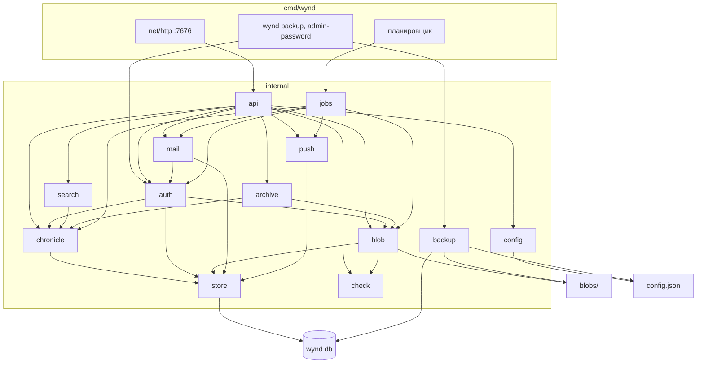

# Серверный слой — справочник

Решения серверного слоя по темам: что решено и почему. Правило формата — подзаголовок на тему, абзац не длиннее 600 знаков, ячейка таблицы — 300 (CONTRIBUTING). Эталоны: [wynd.html](../wynd.html), [stack.html](../stack.html), [screens.html](../visual/screens.html).  
Продуктовые правила: [журнал](../wynd.html#journal), [дни](../wynd.html#days), [квота](../wynd.html#quota), [серверы](../wynd.html#servers).

---

## Архитектура

Стрелка — импорт Go (`go list -f '{{.Imports}}'`). Не показаны листовые пакеты, которые импортируют многие: `xtime` (метки времени), `uid` (UUID v7), `version`, `proxy` (таймаут прокси для сниппетов и проверки). `backup` не ходит через `store`: он открывает `wynd.db` сам и снимает копию `VACUUM INTO`, рядом кладёт `config.json`, `keys/` и блобы.

---

## Ключевые решения

Зафиксировать в коде, не пересматривать по ходу. Разделы — по предмету; внутри раздела пункт начинается с того, что решено.

### Модель и термины

- **Термин `circle` везде** в коде и JSON (`circle_id`, не `group`/`space`).
- **Код на английском**, строки писем и пушей — на русском.
- **Идентификаторы — UUID v7.** Курсор sync — монотонный `seq` внутри инстанса.
- **Аккаунт ≠ идентичность.** Аккаунт: почта на этом сервере. Идентичность: имя и лицо в одном круге, версионна. Admin API не отдаёт связку «один email — несколько лиц».
- **У инстанса есть имя.** Короткая строка («Дом Ани»); задаётся при первом запуске. Идентификатор сервера — адрес.
- **Учётка двумя путями:** приглашение в круг или регистрация без круга. Режим инстанса: `open` | `invite` (умолч.) | `closed`.
- **Сервер не знает о других серверах.** Миграция круга между инстансами — не реализована; UUID заложены.
- **Хроника — источник sync, снимок — источник чтения.** Одна SQLite-транзакция: событие + проекция.
- **Журнал — сказанное и структура.** Подробнее — [образ, журнал](../wynd.html#journal).
- **Отрезки видимости** — интервалы `[started_at, ended_at)` на пару (account, circle). Повторный вход — новый интервал.
- **Окно правок** — параметр круга (0 = летопись). У каждой единицы сказанного своё окно; смена параметра действует только вперёд. `SetEditWindow` отвергает отрицательные секунды (`invalid`); `0` — летопись, `nil` — без ограничения.
- **Три времени записи:** `created_at` (sync, лента), `entry_date` (отнесение, правится в окне), `captured_at` (EXIF, справочно).
- **День — проекция** `(circle_id, entry_date)`. Название и обложка — сказанное.

### Хранилище

- **SQLite** через `modernc.org/sqlite`. WAL, `busy_timeout`, `foreign_keys`. Один процесс на файл БД; второй на том же `wynd.db` вне модели. Пул `SetMaxOpenConns(1)` не ставим. Интерфейс `store.Store` — Open/Close/Ping/Version; драйвер один.
- **Миграции.** Baseline `0001_schema.sql`; поверх — `0002_search_days`, `0003_notify_prefs`, `0004_payment`, `0005_search_day_replace`, `0006_invite_target_account`, `0007_storage_quota_disk_percent`, `0008_smtp_last_error`, `0009_instance_quota_default_percent`, `0010_session_token_hash`, `0011_timestamps_fixed_width`, `0012_day_title_fts`, `0013_client_id`, `0014_pay_request_pending_unique`, `0015_code_request_log_email_index`, `0016_pending_joins_expiry`. Текущая схема **v16**.
  - Старый `wynd.db` с версией не из этой цепочки — удалить. Мигратор: пропущенная версия ниже `MAX(version)` — отказ запуска, не применение; неизвестная версия в `schema_migrations` — «удалите wynd.db». Подробнее — «Legacy и сроки снятия».
  - Номера отличаются от текста плана 42: волна 1 вышла раньше волны 2, а дыр в середине цепочки не бывает. Соответствие: сессии — 0010, метки времени — 0011, названия дней — 0012, `client_id` — 0013, одна заявка на оплату — 0014, индекс журнала кодов — 0015, срок отложенного вступления — 0016.
- **Время в БД — фиксированная ширина.** `xtime.Layout` = `2006-01-02T15:04:05.000000000Z`: ровно 30 символов, всегда UTC, всегда девять знаков дроби. `RFC3339Nano` обрезал хвостовые нули, и SQLite, сравнивая строки лексикографически, ставил `10:00:00.2501Z` раньше `10:00:00.25Z`.
  - Формат пишется **только** через `xtime`; прямых `time.RFC3339Nano` в коде нет. Миграция 0011 выровняла существующие значения (48 колонок, перечень в её заголовке). JSON снаружи может остаться секундами (`RFC3339`).
- **Транзакции.** Пишущие пути хроники открываются через `beginWrite`; подключение настроено на `BEGIN IMMEDIATE` (`_txlock=immediate` в DSN). Предусловия читаются **в той же транзакции**, что и запись: `DeletePost`, `DeleteCircle`, `TransferOwnership`, `SetCircleName`, `PatchCircle`, `Leave`/`LeaveWithAccess`/`Exclude`, `auth.Bootstrap`.
- **Список кругов аккаунта.** `ListAccountCircles` — три batch-запроса (курсоры, unread постов, последнее видимое событие), не N+1 на круг. Видимость — `sqlVisibleAtMembership`.
- **Снимок ленты/сетки** — потолок `chronicle.SnapshotPostLimit` (2000 постов). Выбирается `LIMIT 2001`; превышение обрезается и пишется в лог с `circle_id`. Круг больше — вне модели, не пагинация API.
- **Бэкап** — `VACUUM INTO`, не копия голого `wynd.db` при WAL. `wynd backup` отказывается работать, если в каталоге данных нет непустого `wynd.db`. Порядок бэкапа и восстановления для оператора — README.
  - Порядок шагов: база снимается первой, блобы — после; блоб, удалённый рутиной между шагами, останется строкой без файла в копии (архив такой пропускает, ARC-4). Каталог назначения внутри `blobs/` копирует сам себя — не указывать. Оба случая приняты, не исправляются (BKP-6, BKP-7).

### HTTP и API

- **HTTP — stdlib**, порт **7676**.
- **Liveness / ready.** `GET /health` — процесс жив. `GET /ready` — `Ping` SQLite.
- **Хелперы обработчика.** `internal/api/respond.go`: `requireSession(w, r)` и `bindJSON[T](w, r)` — сессия и тело с уже написанным ответом об ошибке. Обработчик начинается с них, а не с копии тех же восьми строк. Ошибка JSON encode и немаппленный domain-error — в лог.
- **OpenAPI — оглавление, не контракт (DEC-2).** `internal/api/openapi-participant.yaml` и `openapi-admin.yaml` перечисляют маршруты с кратким описанием ответов; схем тел нет и писать их не нужно. Сервер спеку не отдаёт, клиент типы из неё не генерирует (контур `openapi-typescript` снят в волне 5 плана 42) — типы пишутся руками в `$lib`.
  - Спеку держат сторожа: `TestOpenAPICoversMuxRoutes` (маршрут в `server.go` ↔ операция в своей спеке, деление по префиксу `/admin/`), `TestMuxRouteCountMatchesParsedOps`, `TestOpenAPIVersionMatchesVERSION`. Новый маршрут попадает в спеку тем же коммитом.
- **Адрес исходников (AGPL §13).** `version.SourceURL` — единственное место, где он записан; отдаётся полем `source_url` в `GET /api/v1/instance`, клиент берёт оттуда. Публичный адрес — зеркало на GitHub, рабочий remote — Gitea; подробнее в CONTRIBUTING.
- **Публичные пробы.** `/probe/body` и `/probe/stream` — под счётчиком по адресу: 12 запросов в минуту, дальше 429 с `Retry-After`. `/probe` и `/probe/sse` дёшевы и открыты.

### Конфигурация и адрес инстанса

- **Конфигурация.** `config.Load` ничего не пишет: `config.json` появляется, только когда его сохраняют (bootstrap, панель). Запись — temp+rename. `ValidatePublicURL` отвергает не-http(s), адрес без хоста, с путём, запросом, якорем или учётными данными. Перекрытие сохранённого адреса переменной `WYND_PUBLIC_URL` пишется в лог.
- **Адрес инстанса в рантайме.** `Server.PublicURL()` и `Server.Loopback()` — геттеры (мьютекс и atomic), `mail.Service.loopback` — `atomic.Bool`. Фоновые задачи берут адрес свежим.
- **Общие 9.10.** `PUT /admin/password` `{current, new}` (не короче 8). `PUT /admin/access` опц. `public_url` пишет `config.json` и обновляет loopback у `Auth`/`Mail`.

### Первый запуск (bootstrap)

- **Порядок шагов.** Сначала `ValidatePublicURL` присланного адреса (неверный — `invalid`, установка не начинается: иначе адрес уходил в `config.json`, и сервер после перезапуска не стартовал, потому что `config.Load` проверяет его строго).
  - Дальше до проверки токена не происходит ничего: `ConfirmBootstrapToken` (токен + флаг `bootstrapped`) → длина пароля → `mail.Probe` **несохранённого** релея (сбой = 502 `smtp_failed`, в БД ничего) → одна транзакция `Auth.Bootstrap` + `Mail.SaveConfigTx` → `config.WritePublicURL` → `SendTest`.
  - Сбой проверочного письма установку не откатывает: текст в `smtp_last_error`, ответ 200 с `mail_sent:false`.
  - Флаг ставится `UPDATE … WHERE id = 1 AND bootstrapped = 0` с проверкой `RowsAffected` — из двух параллельных установок проходит ровно одна. Первичная настройка инстанса передаётся в `BootstrapInput.InTx` и применяется вместе с флагом или не применяется вовсе.
- **Поля.** `POST /admin/bootstrap`: `token`, `password`, опц. `instance_name`, `public_url` и SMTP (`host`, `port`, `username`, `smtp_password`, `from`).
  - Не loopback (после `NormalizePublicURL`) — SMTP обязателен (`smtp_not_configured`). Неполный релей на loopback игнорируется, не ошибка. Проверочное письмо на envelope-адрес `from`, если SMTP задан целиком — в том числе на loopback.
  - `public_url` пишется в `config.json` и сразу обновляет loopback у `Auth`/`Mail` (`applyPublicURL`). Caddy API не вызывает; публичный `--public-url` в `install.sh` обязан поднять прокси или выйти с ошибкой (`--own-proxy` — сниппет в лог).
  - `POST /admin/bootstrap/smtp-test`: тот же токен, пока bootstrap не выполнен; поля релея без записи в БД; `mail.Probe` — dial, TLS, AUTH, без письма.

### Вход и сессии

- **Сессии участников — Bearer.** Админ — отдельная сессия, журнал через неё недоступен.
- **Хранение сессий.** В `sessions` хранится `token_hash` = `sha256(token)`; сам токен есть только у клиента. Поиск и отзыв — по хешу. Смена и сброс пароля админа удаляют все админские сессии в той же транзакции; клиент зовёт `POST /admin/logout` до локальной чистки. Soft-delete учётки снимает её `pending_circle_joins` и отзывает адресованные ей личные приглашения.
- **Код входа: выдача.** Хеш — `sha256(pending_id + ":" + code)`. Расход кода проверяется по `RowsAffected` (ноль → `invalid`).
  - Лимит запросов заряжается **до** поиска учётки (`chargeRate`) и засчитывает попытку в том числе неизвестному адресу; `code_request_log` пишется там же, не в `issueCode`.
  - Проверка и запись — один `INSERT … SELECT … WHERE COUNT < ?` с `RowsAffected`: раздельные SELECT и INSERT пропускали параллельные запросы сверх потолка. Адрес нормализуется одинаково в записи и в счёте (пустой → `unknown`). Счёт по ящику опирается на индекс `code_request_log (email, requested_at)` (0015).
- **Код входа: доставка и лимит.** `GET /instance` отдаёт `code_delivery`: `log` на loopback, если SMTP не сконфигурирован или проверка SMTP не удалась, иначе `mail`. Лимит кодов: `retry_after_sec` в JSON и `Retry-After` (секунды до выхода самой старой записи из часового окна; email 5 и IP 10 — больший из двух). Почта: `ParseParticipantEmail` (`net/mail.ParseAddress`, local и domain непусты, в domain есть `.`).
- **Попытки ввода кода.** У кода три попытки, но считаются они ещё и по адресу обратившегося (`verifyLimiter`, 10 неудач за 15 мин → замок на 15 мин): знающий чужую почту сжигал её три попытки сколько угодно раз и запирал вход хозяину. Потолок выше, чем у пароля админа, — за одним адресом может сидеть семья.
- **Общее ведро неудач входа.** Ключ `*` в `failLimiter` **замедляет** (пауза 2 с), а не запирает: 50 неудач с любых адресов закрывали вход в панель самому хозяину на всё окно — отказ в обслуживании чужими руками.
- **Заблокированная учётка.** В режиме `open` ответ `POST /auth/code` одинаков для любого адреса, поэтому заблокированному — 200 **без письма**: иначе endpoint показывал, кто здесь есть и кого закрыли. В `invite` и `closed` отказ незнакомому адресу виден и так, там остаётся `forbidden`.
- **Личные приглашения.** `AcceptInvite` сверяет `target_account_id` до выдачи кода: чужому адресу письмо не уходит. Отдельного «расхода» личной ссылки при выборе имени нет — она израсходована в `Verify`.

### Почта

- **SMTP / VAPID не настроены.** `mail.ErrNotConfigured` / `push.ErrNotConfigured` → 400 `smtp_not_configured` / `push_not_configured`, не 500.
- **Сбой отправки** → 502 `smtp_failed`, где `detail` — **метка причины** (`dial` | `tls` | `starttls_required` | `auth` | `protocol`), а не ответ релея: сырая строка уходила в панель как есть, вместе с чужими именами хостов. Полный текст остаётся в журнале сервера (`mail.SendError`).
- **Разговор с релеем.** Порт 465 — implicit TLS, иначе STARTTLS; не дольше 15 с. Вне localhost письмо не уходит без TLS: релей без STARTTLS — ошибка `STARTTLS required` (502). `MAIL FROM` и `RCPT` — envelope-адрес из «От кого» / получателя (display-name в угловых скобках срезается). CR/LF в адресах и теме заменяются пробелом до кодирования.

### Push и уведомления

- **Подписка.** Принимается только на `https` и только на публичный адрес (loopback, private, link-local, CGNAT, `0.0.0.0/8` — отказ); нерезолвимое имя принимается. Проверка при подписке смотрит DNS один раз, и имя можно перевести на loopback после неё — поэтому адрес проверяется ещё и при доставке.
- **Доставка — своим клиентом.** Таймаут 10 с, редиректы не выполняются, а `DialContext` резолвит хост сам и набирает только публичные адреса (имя с хотя бы одним непубличным адресом не набирается вовсе). Прокси из окружения не берётся — через него проверка адреса ничего не значила бы. В ошибке остаётся хост без пути: путь endpoint равносилен ключу от устройства.
- **Обход подписок.** Список снимается целиком **до** первой доставки: курсор по таблице не держат открытым на время сетевых запросов, а удаление снятой подписки внутри того же обхода вставало замком. Подписку снимают только 404 и 410; 400, 429 и 500 её оставляют.
- **Прочее push.** VAPID `sub` = `mailto:admin@wynd.local`. Пакет `push` не импортирует `auth`. `notifyCircle` логирует ошибки членства, prefs и `SendSignal`. Горутина — 10 с; `WaitNotify` после `http.Server.Shutdown` (тот же ctx, 10 с).
- **Notify.** `comments_mine` / `comments_all` / `events` / `mute_until`. Умолчание реакций — выкл. Упоминание пробивает mute. Пуш `mention` при создании записи и комментария (правка тела — нет). Учётные умолчания `DefaultNotifyPrefs`: `comments_all`/`events` выкл., mute пустой. 7.3 не создаёт строку `circle_notify_prefs`; круг без своей 6.9 читает живой `account_notify_prefs`.

### Sync и SSE

- **SSE** — опрос SQLite раз в 2 с, без LISTEN/NOTIFY. Три вида одного потока (JSON, SSE, NDJSON) отдают одни и те же события в одном порядке и с одинаковым телом — это сторожит тест.
- **Курсор впереди сервера.** `cursor > MAX(events.seq)` — база восстановлена из бэкапа, клиент помнит номера прежней жизни. Сервер считает курсор равным `max_seq` (иначе новые события не доходили бы, пока счётчик не догонит), а SSE начинается кадром `event: hello` / `data: {"max_seq": N}` — по нему клиент сбрасывает курсор и снимки. Сдвигать `sqlite_sequence` при восстановлении не нужно (план 42, BKP-3).
- **Жизнь потока.** Поток перечитывает сессию и подписку перед каждым опросом; комментарный кадр `:\n\n` раз в 15 с; дедлайн записи 30 с. Базовый контекст сервера отменяется по сигналу, поэтому `Shutdown` не ждёт открытые потоки. Ошибка `Shutdown` — `log.Printf`, дальше `WaitNotify`, ожидание рутины, закрытие БД.
- **Клиент потока.** Сторож тишины 45 с, повтор `min(5 с · 2^n, 60 с)` с джиттером, парсер по спецификации (CRLF, `data:` без пробела, многострочный `data`).
- **Идемпотентность очереди.** Клиент кладёт `client_id` (UUID) в тело POST записи и комментария; уникальный индекс `(circle_id, client_id)` и повтор возвращает уже созданную сущность (миграция 0013). Поле необязательное.
  - Слив очереди на клиенте: `navigator.locks` (без Web Locks — прежний флаг), группировка по origin (недоступный сервер задерживает только свою группу), `attempts` + пауза `min(30 с · 2^n, 15 мин)`, 401 оставляет запись `pending`, `uploading` старше 2 мин снова считается `pending`.

### Журнал: записи, комментарии, реакции, дни

- **Право писать своё.** Править и удалять своё (запись, комментарий, реакцию, обложку) может только тот, кто **сейчас** может писать. Один шлюз `requireAuthor` поверх `CanWrite`: сверяет `identity_id` автора и право записи. Вышедший с доступом и исключённый — `forbidden`, даже внутри окна правок. Инлайн-сверок `mem.IdentityID != …` в мутаторах не заводить.
- **Текст.** Тело записи, комментария и названия дня — не длиннее 32768 байт UTF-8. Создание: `TrimSpace(body)==""` без media и комментарий из пробелов — `invalid`; в базу пишется уже обрезанный текст. Правка записи из пробелов без медиа — тоже `invalid`. `entry_date` — строго `YYYY-MM-DD` (parse + format round-trip; `2026-02-30` не принимается).
- **PATCH записи.** Поле `media` опущено — медиа не трогать; пустое тело + пустой `media` — `invalid`; квота только на **добавленные** блобы; снятие cover-блоба — `reconcileDayCoverAfterBlobRemovedFromPost`. `cover_blob_id` вместе с `media[]` — `invalid` (media задаёт обложку сама).
- **Пределы ввода (аудит 2026-09-22).** Не больше 50 вложений на запись: клиент столько и не предлагает, но запрос мимо него заводил сколько угодно строк `post_media` и `blob_refs`. `edit_window_sec` проверяется и в `POST /circles`, не только в `PATCH`. Название дня приходит обрезанным по краям; из одних пробелов — не название. `mute_until` разбирается как RFC3339 **при сохранении** и хранится в UTC: неразобранная строка молча означала «не заглушено».
- **Удаление записи.** `Chronicle.DeletePost` — одна транзакция: предусловия, скраб ветки, `post_media`, `blob_refs`. Возвращает список блобов; обработчик освобождает их после коммита, ошибка освобождения только пишется в лог. Так же устроены `purgePostBranch` и `DeleteCircle`.
- **Реакции.** В API только ключи `heart` | `laugh` | `surprise` | `anger`; иначе `ErrInvalid`. Миграции старых эмодзи нет. `reactionResponse` несёт окно правок. `DELETE .../posts/{post_id}/reactions` ищет свою реакцию на пост, затем `DeleteReaction` по id.
- **Лицо автора в снимке.** `feedPostResponse` / `commentResponse` несут `author_avatar_blob_id` из `IdentityAvatarBlobIDs` (тот же набор, что у поста). Реакции — без лица.
- **Имя в круге.** `addIdentityName` копирует `avatar_blob_id` с предыдущей неистёртой строки той же идентичности.
- **Карта.** `GET /circles/{id}/map` пины из `post_media` с координатами: `post_id`, `blob_id`, `entry_date`, `created_at`, `geo_lat`, `geo_lng`, `author_name`, `body`. Гео на записи без медиа нет (`POST /posts` без top-level `geo_lat`).

### Поиск

- **Запрос.** Слова по пробелам, каждое в кавычках, соединение `AND`; управляющие символы вырезаются; не более 256 байт и 8 слов; пусто — `invalid`. Префиксного поиска нет.
- **Что ищется.** FTS `kind` = `post` \| `comment` \| `day`. День: пустой `post_id`, `LEFT JOIN posts`. Попадание несёт `thumb_blob_id` (первый photo/video `post_media` записи).
- **Название дня.** Смена названия — INSERT в `day_titles`; триггер `fts_day_insert` заменяет предыдущую FTS-строку дня. Триггеры `day_titles` пересобирают строку FTS из таблицы и берут актуальную версию (наибольший `event_seq` среди неудалённых и непустых) — миграция 0012.
- **Фильтры.** Query: `from`, `to`, `has_photo=1`, `has_location=1`, `author` (только поиск круга). `GET /circles/{id}/search/authors` — DISTINCT `author_name` из попаданий FTS (до 100), не участники; те же фильтры, кроме `author`.

### Круг: настройки, участники, приглашения

- **Настройки круга.** `PATCH /circles/{id}` — один `Chronicle.PatchCircle`: значения проверяются до первой записи, изменения применяются вместе.
- **`account_id` в участниках — не всем.** `GET /circles/{id}/members` отдаёт `account_id` только владельцу и тем, у кого право на настройки. Учётка на сервере — не лицо в круге; связывать лица в разных кругах по ней обычному участнику незачем. Клиент строит ключи `{#each}` и упоминания на `identity_id`, а действия владельца — под проверкой наличия `account_id`.
- **Серверный инвайт.** `createInviteBody.ttl_sec`; иначе неделя. Инвайт круга — `ttl_sec`; иначе 3 дня. `GET /invites/{token}` для `circle_id IS NULL` отдаёт `{server_name, host, inviter_name?}` без круга (не 404). `inviter_name` — живое лицо создателя ссылки; у sentinel его нет, тогда имя владельца самого старого круга; кругов нет — поле опущено, на 1.7 только адрес.
- **Потолки ссылки.** `max_uses` ≤ 100, `ttl_sec` ≤ 30 суток — иначе `invalid`. UI и так предлагает 25 и неделю; отказ касается запросов мимо него.
- **Какие ссылки можно создать.** `circles.invite_kind_default`: `single` — создавать можно только одноразовые; `multi` — многоразовые разрешены. Это не предвыбор чипа на 6.5: создание всегда стартует как одноразовая 72 ч. `POST /circles/{id}/invites` `kind=multi` при `single` → `invalid`. Живые многоразовые при переключении на `single` не отзываются.
- **Просмотр ссылки.** `GET /invites/{token}` проверяет её целиком (`ValidateInvite`: режим сервера, отзыв, срок, остаток лимита), а не только отзыв и срок: исчерпанная ссылка показывала постороннему название круга и список участников.
- **Живые ссылки.** `GET /circles/{id}/invites` — неотозванные, неистёкшие, с остатком лимита, **без** `target_account_id` (личное «позвать» в «Живые» не попадает). `DELETE /circles/{id}/invites/{id}` — отзыв (только свой круг). Клиент: экран 6.21 `/settings/invites`, не низ 6.5. Панель: `GET/DELETE /admin/invites` — то же для серверных ссылок (`circle_id IS NULL`).
- **Позвать из других кругов.** `GET /circles/{id}/invite-candidates` — люди из других кругов вызывающего, без уже `active` в `{id}` (вышедший с живой учёткой остаётся). `GET /pending-circle-joins` — круги, где ещё не выбрали имя.
  - `POST /circles/{id}/member-invites` `{account_id}` — одноразовая персональная ссылка + `pending_circle_joins`; `Chronicle.Join` только в `CompleteCircleJoin` (`POST /circles/{id}/join` с именем 1.3, имя с другого круга не копируется). `invite_kind_default` на member-invites не действует. `member.invited` — служебное событие с пустым summary (на ленте скрыто) + пуш `event`.
- **Отложенное вступление.** Строка `pending_circle_joins` — это и есть право войти в круг (`POST /invites/{token}/join` больше ничего не проверяет), поэтому у неё есть срок и `invite_id` (0016). После ссылки право живёт сутки, у личного приглашения — столько же, сколько сама ссылка. Строка без срока недействительна. Снимают её: отзыв ссылки, выход и исключение пригласившего, блокировка и удаление его учётки, суточная рутина (вышедший срок, отозванная ссылка).
- **Отзыв ссылок автора.** Выход и исключение отзывают ссылки ушедшего **в этот круг** (`RevokeCircleInvitesBy` из обработчика, сбой — в лог); блокировка и удаление учётки — все её ссылки. Страховка — суточная рутина: отзывает живые ссылки, чей автор заблокирован, удалён или больше не `active` в круге.

### Блобы и загрузки

- **Блобы** — без ffmpeg: сервер кладёт и отдаёт байты. Видео жмёт клиент (WebCodecs). SVG и HTML всегда `Content-Disposition: attachment`. `sanitizeFilename` обрезает имя по рунам (255), не по байтам.
- **Доступ к блобу.** `CanAccessBlob`: владелец; медиа записи в отрезке `can_read` (`p.created_at`); аватар идентичности — читающий участник круга, у `left_with_access` — идентичности с `created_at` до `ended_at` спана, не `datetime('now')`.
- **Загрузки.** Завершение: строка `blobs` в состоянии `pending` → `os.Rename` → `complete`. Ошибка чанка усекает `.part` до прежней длины, `UPDATE received_bytes` условный. В потолок инстанса входят открытые сессии и `blobs` со статусом `pending`; на завершении квота перепроверяется.
- **Загрузка под `participant`, не `paid` (аудит 2026-09-22).** `/uploads*` открыты истёкшему участнику — иначе он не мог приложить скриншот оплаты. Владение и квоту проверяет `blob.Store`; привязать блоб к записи, аватару или обложке без оплаты нельзя — эти маршруты под `paid`. Резерв квоты открытых сессий считается по принятым байтам (`received_bytes`), а не по заявленному размеру.
- **Ссылки на блобы.** Истина — сами ссылающиеся таблицы, а не `blob_refs`: последняя их дублирует и отстаёт. Один предикат `internal/blob` покрывает `blob_refs`, `post_media`, `day_covers (deleted = 0)`, `days.cover_blob_id`, `identity_names (erased_at IS NULL)`, `pay_requests`; им пользуются рутина, `gcBlobIfUnreferenced` и оплата.
  - `IsReferenced` отвечает «строку `blobs` удалять нельзя» (скриншот оплаты держит её внешним ключом всегда), `IsFileNeeded` — «файл на диске ещё нужен» (скриншот с `blob_deleted = 1` уже не держит). `ReferencedPredicate(col)` — тот же предикат для выборок по многим блобам.
  - Порядок удаления: сначала `DELETE FROM blobs`, потом `os.Remove`, иначе отказ по внешнему ключу теряет файл. Таблица `blob_refs` остаётся (её удаление — решение после 1.0).

### Квота и архив

- **Потолок инстанса:** `storage_quota_bytes` (абсолют) **или** `storage_quota_disk_percent` (1–100, эффективные байты = % × том каталога данных); одновременно только один режим. Заводское умолчание — **80% диска** (миграция 0009 ставит процент там, где ещё 100 ГБ абсолютом и процент NULL); колонка байт `NOT NULL`, эффективные считаются из процента, если он задан.
  - `PUT /admin/storage/quota` — `{quota_bytes}` или `{quota_disk_percent}`; на `/admin` (9.5) — ГБ **или** `%` тома. Не смешивать с `PUT /admin/storage/default_quota`.
- **Квота круга.** `instance_settings.default_circle_quota_bytes` (`NULL` = нет потолка круга). `circles.quota_custom`: 0 → умолчание инстанса; 1 → `circles.quota_bytes` (`NULL` = без квоты). Смена умолчания круги не UPDATE-ит.
  - `PUT /admin/circles/{id}/quota` `{custom, quota_bytes?}`: `custom=false` игнор тела; `custom=true` + число — своя; без числа — без квоты. Ниже `media_bytes` и выше потолка инстанса ставить можно. Событие хроники не писать.
  - Заявка: pending при PUT — `approved` + `resolved_at` (абсолют). `POST .../approve` ставит `quota_custom=1` и `quota_bytes = requested` (абсолют); UI «Дать» зовёт `PUT .../quota`, не approve.
- **Цикл архивации по квоте** — событие круга. `cutoff_locked_at` при первом скачивании архива. Пока цикл активен, комментарий и реакция на пост с `created_at` раньше UTC-полуночи `cutoff_date` — `forbidden` (`assertPostInteractive`). Тот же хелпер режет запись вне отрезка видимости.
  - ZIP и `PurgeBeforeCutoff` не менять: комментарии после отсечки в архив не входят; purge стирает ветку поста до cutoff.
  - Название дня, сказанное до отсечки, purge стирает — поэтому оно в архиве: рядом с датой записи в ленте и на странице записи, в оглавлении раскладки `posts` (`ArchiveDayTitles`; только дни, в которых у читателя есть запись среза — как в списке дней).
- **Срок цикла** — не раньше чем через сутки (`MinArchiveWindow`) от старта или переноса, иначе `invalid`; экран срока не даёт выбрать раньше завтрашнего дня (ARC-7).
- **Недоступный файл** (строка не `complete` или файла нет на диске) в архив не идёт и не роняет его: пропуск, строка в журнале, в HTML — «Файл недоступен на сервере» (ARC-4). Начало записи в оглавлении — 60 рун, обрыв на пробеле (ARC-3).
- **Сборка архива.** ZIP пишется потоком во временный файл `<data>/tmp/archive-*.zip` (каталог 0700, чистится при старте), отдаётся `http.ServeContent` — `Content-Length` и `Range`. Сборка детерминирована (время файлов в ZIP нулевое, порядок — порядок среза), поэтому Range-запрос собирает архив заново и отдаёт те же байты; `Last-Modified` — начало цикла. Медиа — `zip.Store`, HTML — Deflate. Одна сборка на учётку, повтор — 429 с `Retry-After: 30`.
- **Фоновые задачи архива** (`RunArchiveJobs`, ежечасно). Круги независимы: сбой purge или почты одного круга пишется в журнал и не останавливает остальные. Напоминание уходит всем адресатам круга и считается отправленным, если ушло хотя бы одно письмо — иначе круг повторяется в следующий час; отказ одного адреса не повторяет письмо остальным.
- **Отсечка фиксируется после сборки, не после отдачи.** `LockCutoff` ставится, когда ZIP собран: обрыв на отдаче оставляет отсечку замершей, хотя никто ничего не получил. Принято — владелец может начать новый цикл (ARC-8). Письма о старте цикла уходят в запросе `POST …/archive`, ошибки не показываются владельцу — только журнал (ARC-9). Аватары лиц среза — запрос на лицо (`IdentityAvatarBlobIDs`): на десятках лиц незаметно (ARC-10).
- **Оценка архива.** `EstimateArchivePersonal` — число **complete** блобов видимого среза, их байты, число записей; в ZIP те же complete-файлы.

### Панель: учётки и проверка

- **Список и карточка учётки.** `GET /admin/accounts` без `deleted_at`; `circle_count` — только `memberships.status='active'`. `GET /admin/accounts/{id}`: `{id,email,created_at,last_login_at,blocked,owns_circle,subscription_required,subscription_expires_at,circles:[]}` — лица нет, `circles` всегда массив, `joined_at` из `memberships.created_at`. `last_login_at` — только после успешного participant-кода.
- **Удаление учётки** — soft-delete, не `DELETE FROM accounts` (blobs `ON DELETE CASCADE`). `DELETE /admin/accounts/{id}`: владелец круга → 409; sentinel → 404; `LeaveInTx` (Gone) и soft-delete в **одной** транзакции.
  - `identities.account_id` NULL (`UNIQUE (circle_id, account_id)` тогда допускает несколько отвязанных лиц на круг — SQLite NULL ≠ NULL); `deleted_at`, `blocked=1`, email `deleted+{id}@wynd.local`; сессии как при block. Повторная регистрация той же почты — новый account. Записи и хронику не трогать.
  - `jobs.cleanEmptyAccounts` — тот же soft-delete: `created_at` старше 30 дней и нет ни одной строки `memberships` (любой `status`); владелец круга джобом не трогается.
- **Проверка 9.8.** HTTP→HTTPS 301/308 считает сервер (`check.ProbeHTTPRedirect` по `public_url`), в строке — фактический код, не всегда 308. Браузерная проба тела — `body_probe_bytes` из `GET /probe` (`min(attachment_max_bytes, 2 МБ)`). Длинная отдача — `GET /probe/stream`; строка «Таймаут» после `runChecks` (`proxy_read_timeout_sec`, не заглушка в UI).
  - Домен: A-записи сверяются с адресом исходящего сокета сервера. Если он приватный (RFC 1918, CGNAT 100.64/10, loopback, link-local) — сервер за NAT, свой публичный адрес ему не узнать: `warn` «сверьте вручную», не `fail` (CHK-1).
  - Сертификат (строка «Let’s Encrypt», название из кадра): проба — обычное TLS-рукопожатие на порт из `public_url`; при отказе цепочка берётся из `tls.CertificateVerificationError`, без `InsecureSkipVerify`, и отказ раскладывается: истёк, не для этого домена, самоподписанный, неизвестный центр или неполная цепочка (CHK-2). Любой доверенный центр — `ok`; Let’s Encrypt узнаётся только по Organization, CN не смотрим (CHK-3). `warn` — когда осталось меньше четверти срока жизни сертификата: ACME-клиенты продлевают за треть, значит продление не прошло; фиксированные 30 дней горели бы у 45-дневных сертификатов постоянно.
  - Разбор `public_url` один на все пробы (`parsePublicURL`): IPv6 без скобок, порт по схеме. При HTTPS на нестандартном порту строка «HTTP → HTTPS» — `na`; иначе проба идёт на порт 80 и засчитывает только 301/308 с `Location: https://…` (CHK-4, CHK-5). Вся проверка — не дольше 15 с, TLS и редирект параллельно (CHK-6).
  - NTP — один запрос к `pool.ntp.org` без учёта задержки и проверки ответа сервера (stratum, длина): при пороге 5 с этого хватает; мусорный ответ даст ложное расхождение, не сбой (CHK-7).
  - Почта — `mail`: `smtp_test_sent_at` и `smtp_last_error` (успех или текст сбоя). DKIM нет. Сниппеты nginx/Caddy/Traefik — заголовки клиента и read timeout 300 с (`internal/proxy.ReadTimeoutSeconds`, `deploy/proxy/*`).

### Оплата

- **Схема.** `0004_payment.sql`: реквизиты, баннер сбора (`until` — `YYYY-MM-DD`, действует до конца этой даты UTC), подписка. Версию баннера поднимать только когда `show` и текст/срок реально меняются.
- **Срок подписки.** Продление `max(now, subscription_expires_at)+days` (бессрочная с даты в будущем считается от сегодня). Бессрочно — `subscription_expires_at = 9999-12-31T00:00:00Z`, не пустой срок: пустой — «не было» и `expired=true` при `required`.
- **Транзакции оплаты.** Всякое «прочитал → решил → записал» — в одной `BeginTx` (DSN даёт `BEGIN IMMEDIATE`): создание заявки, approve, reject, продление без заявки (`GrantPayAccount`). Файл скриншота удаляется **после** коммита (`detachPayRequestBlob` возвращает путь), чтобы откат не оставил строку без файла (PAY-3, PAY-4, PAY-6).
- **Заявки и удалённые учётки.** Список заявок и счётчик в хабе не показывают заявки удалённых учёток; approve такой заявки — `not_found`, заявка остаётся `pending` (PAY-5). Блоб, чей файл уже снят по прежней заявке (`blob_deleted = 1`), к новой не приложить — `invalid` (PAY-2).
- **Округление дней в напоминании** — вниз: при `remind_days = 1` и сроке через 47 ч напоминание скажет «1 день». Принято (PAY-7).
- **Оплата остаётся в `auth`** (PAY-9): вынос в `internal/pay` дал бы пакет со связностью `admin_access.go` и `invites.go`, которые тоже живут в `auth`; размер файла — не довод. При следующей крупной правке — разбить `pay.go` на `pay_settings.go`, `pay_requests.go`, `pay_gate.go` внутри пакета.
- **Шлюз** — layout `/circles` и `/search` **и** API кругов (`RequirePaidParticipant` → 403 `payment_required`, когда `required && expired && has_requisites`). Шлюз и опрос SSE спрашивают `PaymentRequired` — один запрос на три поля; полный `PayStatus` (четыре запроса) — только экрану оплаты. Что они решают одинаково, сторожит `TestPaymentRequiredMatchesPayStatus`. `PayStatus.reminder` не ставится при `pending`. Письмо напоминания — SMTP `mail.notify`, плюс пуш `subscription`.
- **Админ.** `GET/PUT /admin/pay/accounts/{id}` (`days` или `unlimited`) без строки в `pay_requests`; список `GET /admin/pay/accounts`. List / by-id / grant при выключенном шлюзе — `invalid` (ошибку `loadPaySettingsRow` не глотать). GET/PUT не трогают sentinel `admin@wynd.local`.
- **Заявки.** Скриншот обязателен для заявки участника. Одна ожидающая заявка на учётку — частичный уникальный индекс `idx_pay_requests_one_pending` (миграция 0014) плюс проверка в транзакции; approve — `UPDATE … WHERE status = 'pending'` с `RowsAffected`.
- **Скриншоты.** Одобренной заявки: файл удаляется после истечения срока, строка `blobs` остаётся из-за FK. Отклонение заявки удаляет скрин сразу.

### Ежедневная рутина

- **Планировщик** (`cmd/wynd/main.go`): одна горутина — первый прогон сразу после старта, дальше тикер раз в час. Каждый прогон: суточная рутина (если с `last_routine_at` прошло ≥ 20 ч), задачи архива, задачи оплаты — последовательно, наложиться сами на себя не могут. Сервер начинает слушать, не дожидаясь первого прогона (SCH-1). Контекст прогона — базовый контекст сервера: по сигналу остановки идущая рассылка прерывается (SCH-2). Порог 20 ч, а не 24, чтобы час тикера не сдвигал рутину за сутки; время суток рутины от этого блуждает на 3–4 ч в день — принято (SCH-3).
- **Задачи оплаты** независимы так же, как шаги рутины: сбой уборки скриншотов не отменяет напоминаний (SCH-6). Напоминание считается ушедшим, если ушёл хотя бы один канал — письмо или пуш; письмо после удачного пуша не повторяется (SCH-5, PAY-8).

- Все шаги выполняются всегда, ошибки собираются `errors.Join`, `last_routine_at` пишется в любом случае. Ранний выход на первой ошибке недопустим: он навсегда оставлял инстанс без уборки сессий, кодов, инвайтов и загрузок. Ручного `POST /admin/routine` нет — рутину запускает только планировщик.

### Принятые риски

- **Секреты в БД (DEC-1).** SMTP-пароль и приватный ключ VAPID лежат в `instance_settings` открытым текстом: релей требует пароль при каждой отправке, а мастер-ключа для шифрования на домашнем инстансе взять негде — он лёг бы рядом, в том же каталоге. Следствие: любой бэкап и любой дамп БД содержат оба секрета.
  - Требование: права `0600` на `wynd.db` и на каталог бэкапов, бэкап не кладётся в общедоступный каталог. Условие выполняет код: `wynd.db` создаётся и выравнивается до 0600 при старте, копия в бэкапе — 0600, каталог бэкапа — 0700 (аудит 2026-09-22).
  - Токены сессий этим риском **не** покрыты — в БД лежит `sha256(token)` (миграция 0010). Шифрование секретов — вне плана 42.
- **Снимок отдаёт текущее состояние (аудит 2026-09-22).** Отрезок видимости применяется к моменту создания записи, комментария и события; правка тела, замена вложений, новый заголовок или обложка дня и новый аватар лица после ухода участника видны вышедшему с доступом в `feed`/`days`/по id блоба, тогда как `sync` этих правок не отдаёт.
  - Замораживать содержимое по журналу для `left_with_access` дорого и противоречит модели «снимок = текущее состояние видимых записей».

---

## Локальный прогон

**Loopback:** host `public_url` — `127.0.0.1`, `localhost`, `::1`. Каталог данных — `dev/data`.

**Поднять:** `go run ./cmd/wynd`. Smoke: `curl http://127.0.0.1:7676/health`.

**На loopback:** bootstrap без SMTP; код входа в лог без релея; экран `/auth/code` при `code_delivery=log` говорит «Код с сервера», не про письмо; `GET /api/v1/instance` отличает закрытый сервер от сломанного; HTTPS/прокси/«снаружи» — «не применимо», не FAIL.

**Здесь закрывается:** хроника, auth, журнал, sync/SSE, поиск, admin API, квота и архив, `go test ./...`.

**SMTP на релеях:** `scripts/test-integration.bat` (`go test -tags=integration ./internal/mail/`). Учётки в `dev/` (в `.gitignore`): `credentials.txt` (секции `# …` с `address`/`port`/`login`/`password`/`from`) или JSON в `dev/credentials/`. Образцы — `internal/mail/testdata/credentials.example.txt`, `smtp.credentials.example.json`. Переопределение: `WYND_CREDENTIALS_DIR`, `WYND_CREDENTIALS_FILE`.

**Здесь не закрывается:** Let's Encrypt, прокси-заголовки, Web Push на localhost, systemd. `http://192.168.x.x` — не loopback-профиль.

**Ворота релиза.** `scripts/test.bat` = `go vet ./...`, `go test ./...`, `go build ./cmd/wynd`, `npm run check`, `check:ui`, `test`, `build`. То же на Unix — `make test`, то же в Gitea — `.gitea/workflows/ci.yaml` (плюс `docker build`). Порядок шагов в CI и Makefile не переставлять: `web/dist` не в репозитории, а `web/embed.go` вшивает его через `go:embed`, и без `vite build` падает уже `go vet ./...`. Коммит, меняющий `VERSION`, допустим только после зелёного прогона на том же дереве; запись «проверено» в CHANGELOG без прогона запрещена.

---

## Инварианты для тестов (хроника)

- новичок не видит прошлое;
- вышедший с доступом видит до выхода, не пишет — в том числе не правит и не удаляет **своё**: запись, комментарий, реакцию, обложку (то же для исключённого);
- вышедший совсем и исключённый не читают; хроника — «покинул круг»;
- владелец может исключить вышедшего с доступом: `can_read` снимается со всех его отрезков, статус — `gone`;
- попадание в поиске видно только вместе с записью-носителем: комментарий — по `posts.created_at` и `deleted = 0`, день — по `entry_date` в датах отрезка;
- повторный вход не открывает дыру между отрезками;
- летопись запрещает правку и удаление;
- смена окна не трогает опубликованное;
- отрицательное окно правок — `invalid`;
- комментарий и реакция — своё окно от момента публикации;
- комментарий и реакция на пост вне отрезка видимости или до отсечки активного архива — `forbidden`;
- пустое (после trim) тело поста без media и комментарий из пробелов — `invalid`; несуществующая календарная дата — `invalid`;
- PATCH поста: omit `media` не трогает вложения; пустое тело + пустой `media` — `invalid`; квота только на новые блобы; снятие cover-блоба откатывает обложку дня;
- удаление ветки: в БД нет текста, в журнале нет строки об удалении;
- backdated-запись не меняет порядок ленты и курсоры непрочитанного;
- удаление последней записи дня уносит день; новая запись тем же числом возрождает пустой день;
- `day_cover_set` без записи за день — отклоняется;
- чистка `identity_names` не меняет события, имя больше не разрешается;
- смена имени копирует `avatar_blob_id` на новую строку `identity_names`;
- распоряжаться кругом может только владелец: удаление, передача, исключение, права, заявка на квоту, начало цикла и срок архива участнику — `forbidden`, состояние круга при этом не меняется;
- круг удаляется только по точному имени (пробелы по краям срезаются);
- передача владения переносит и право на настройки: прежний владелец становится обычным участником;
- комментарий правит и удаляет только его автор — владелец круга не исключение;
- реакция участника на запись одна: повторный PUT заменяет, `DELETE` снимает только свою;
- посторонний не читает ни одну поверхность круга (лента, сетка, карта, дни, день, поиск, авторы, участники, identity, детали) и не видит круг в списке.

## Инварианты для тестов (панель)

- default 5 ГБ + `quota_custom=0` режет медиа; своя `NULL` не режет; смена default не трогает `custom=1`.
- `DELETE /admin/accounts` владельца — 409; блобы участника не каскадятся.
- `SetReaction` отклоняет ключ вне whitelist; `circle_count` не считает `gone`.
- отбитая установка (неверный токен или уже установленный инстанс) не меняет ни SMTP, ни `config.json`, ни `public_url`; из двух параллельных установок проходит ровно одна; неверный `public_url` отвергается до начала установки.
- пароль релея не возвращается ни чтением настроек, ни диагностикой, ни ответом проверки; пустое поле при сохранении — «оставить прежний».
- отказ по заявке на оплату ничего не открывает, решённая заявка второй раз не решается; `/admin/pay/*` — только админская сессия, `/admin/pay/blob` отдаёт лишь скриншоты заявок.
- отказ по заявке на квоту не меняет квоту круга, утверждение ставит запрошенную; отозванная серверная ссылка не открывается и не выдаёт код.
- метки времени пишутся одной шириной: порядок строк совпадает с порядком времени, в том числе внутри секунды;
- повтор POST с тем же `client_id` возвращает уже созданную запись или комментарий, а не создаёт вторую;
- удаление записи и удаление круга освобождают файлы: `OpenBlob` отвечает not_found, файла на диске нет, `blob_refs` пусты;
- PATCH круга применяется целиком или не применяется вовсе;
- миграции применяются к заполненной базе предыдущей версии, а не только к пустой;
- рутина не трогает аватары и обложки дней; переживает скриншот оплаты старше суток; сбой одного шага не отменяет остальные и не мешает записать `last_routine_at`.

## Инварианты для тестов (архив)

- cutoff двигается до первого скачивания и не двигается после;
- архивы двух участников с разными отрезками не совпадают;
- архив открывается офлайн, без внешних ссылок в HTML;
- удаление по deadline срабатывает, даже если скачали не все;
- после удаления служебные события до cutoff остались в логе.

---

## Legacy и сроки снятия

Что держится ради совместимости со старыми данными или старым кодом и когда это снимается. Новый пункт попадает сюда тем же коммитом, что и код, который его вводит. Бывший `legacy-inventory.md` (срез схемы v5) слит сюда.

### Схема БД

- **Мигратор** — `internal/store/migrate.go`, только вверх, без down. Известные версии — `{0}` и номера файлов `NNNN_*.sql`; следующая миграция — `0017_*.sql`. Таблицу `schema_migrations` создаёт код, не файл; `applied_at` — той же фиксированной ширины, что `xtime.Layout` (строкой прямо в `migrate.go`: `store` — листовой пакет).
- **Baseline.** В `0001_schema.sql` свёрнута ранняя цепочка 0001–0013. База с версией не из нынешней цепочки не чинится: «удалите wynd.db». Перенумерации и нового сворачивания не будет.
- **Тесты мигратора.** `TestReopenAppliesMigrationsOnce` ждёт номер последней миграции — правится вместе с каждой новой. `TestMigrationsOnPopulatedPreviousVersion` гонит миграции по заполненной базе v9, `TestMigrateRefusesSkippedVersion` и `TestRejectsStaleSchemaVersion` — отказы.
- **`identities.account_id` может быть `NULL`** — следствие soft-delete учётки (см. «Учётка в панели»). Частичным индексом не чинить: несколько отвязанных лиц на круг допустимы.

### Данные прежнего формата

| Что | Как читается сейчас | Снятие |
|---|---|---|
| Метки времени разной ширины (до 0011) | 0011 выровняла все колонки; `xtime.Parse` читает любую ширину дроби (`TestParseAcceptsLegacyWidths`) | Не требуется: разбор общего RFC3339 и есть норма |
| Реакции-эмодзи ранних версий | В API только `heart` \| `laugh` \| `surprise` \| `anger`; старые значения не мигрированы | Не планируется |

### Код

| Место | Что держит | Снятие |
|---|---|---|
| `web/src/lib/components/` под алиасом `$ui` | Путь импорта сменён, папка — нет. `ui-guard.mjs` (`legacyImports`) ловит `$lib/components` | Не снимается: алиас и есть решение, папку не переносить |
| `/admin/accounts` в API | GUI давно `/admin/people/{id}`, путь API не переименовывается | Не снимается |
| Таблица `blob_refs` | Дублирует ссылающиеся таблицы и отстаёт; истина — предикат `internal/blob` (см. «Ссылки на блобы») | После 1.0, отдельным решением |
| `Chronicle.UnreadPostCount` | Прежний путь N+1; в коде сервера больше не вызывается, живёт как оракул для batch `ListAccountCircles` в `snapshot_circles_test.go` | Вместе с тестом, когда batch-путь закроют другие тесты |
| `Chronicle.LastVisibleEvent` | То же: прежний путь «последнее видимое событие» по кругу, только оракул в `snapshot_circles_test.go` | Вместе с `UnreadPostCount` |

### Снято

- `jobs.expireBefore` — сравнение с метками без дробной части; не нужно после 0011.
- `legacy-inventory.md` — устарел целиком (схема v5), слит в этот раздел в волне 6 плана 42.

---

## Вне scope

- UI, IndexedDB, service worker, офлайн-очередь
- Сжатие медиа на клиенте
- PostgreSQL, UnifiedPush, вёрстка писем
- Миграция круга между серверами
- Группы кругов
- GDPR-экран удаления профиля участником
- SQL `DELETE FROM accounts` из карточки людей; отсечка из панели; лица в GET учётки; событие квоты в хронике
