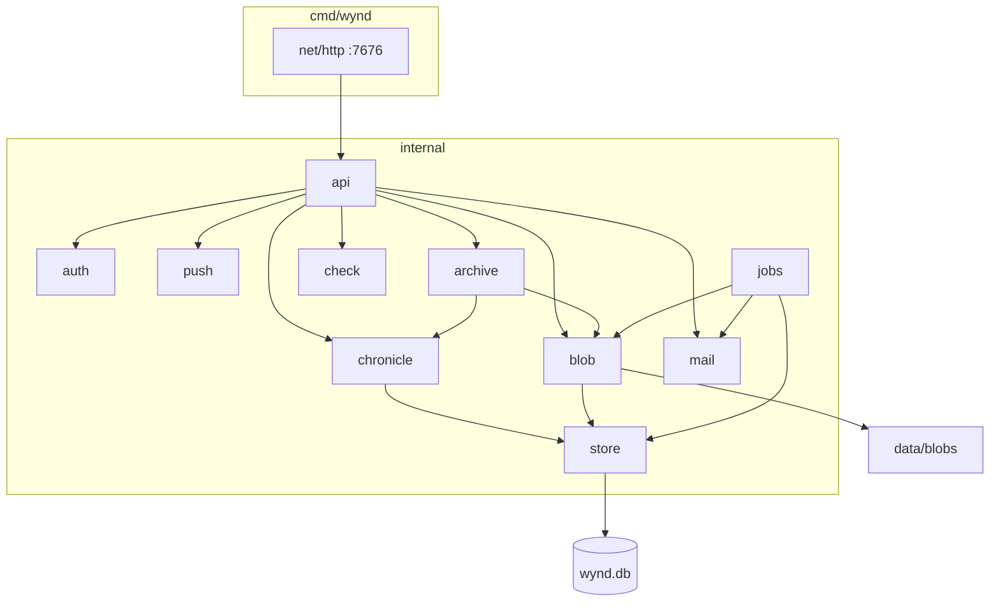

# Серверный слой — справочник

Сжатая выжимка из закрытого плана реализации. Эталоны: [wynd.html](../wynd.html), [stack.html](../stack.html), [screens.html](../visual/screens.html).  
Продуктовые правила: [журнал](../wynd.html#journal), [дни](../wynd.html#days), [квота](../wynd.html#quota), [серверы](../wynd.html#servers).

---

## Архитектура

---

## Ключевые решения

Зафиксировать в коде, не пересматривать по ходу.

- **Термин `circle` везде** в коде и JSON (`circle_id`, не `group`/`space`).
- **Идентификаторы — UUID v7.** Курсор sync — монотонный `seq` внутри инстанса.
- **Аккаунт ≠ идентичность.** Аккаунт: почта на этом сервере. Идентичность: имя и лицо в одном круге, версионна. Admin API не отдаёт связку «один email — несколько лиц».
- **У инстанса есть имя.** Короткая строка («Дом Ани»); задаётся при первом запуске. Идентификатор сервера — адрес.
- **Учётка двумя путями:** приглашение в круг или регистрация без круга. Режим инстанса: `open` | `invite` (умолч.) | `closed`.
- **Сервер не знает о других серверах.** Миграция круга между инстансами — не реализована; UUID заложены.
- **Хроника — источник sync, снимок — источник чтения.** Одна SQLite-транзакция: событие + проекция.
- **Журнал — сказанное и структура.** Подробнее — [образ, журнал](../wynd.html#journal).
- **Отрезки видимости** — интервалы `[started_at, ended_at)` на пару (account, circle). Повторный вход — новый интервал.
- **Окно правок** — параметр круга (0 = летопись). У каждой единицы сказанного своё окно; смена параметра действует только вперёд.
- **Три времени записи:** `created_at` (sync, лента), `entry_date` (отнесение, правится в окне), `captured_at` (EXIF, справочно).
- **День — проекция** `(circle_id, entry_date)`. Название и обложка — сказанное.
- **Цикл архивации по квоте** — событие круга. `cutoff_locked_at` при первом скачивании архива. Пока цикл активен, комментарий и реакция на пост с `created_at` раньше UTC-полуночи `cutoff_date` — `forbidden` (`assertPostInteractive`). Тот же хелпер режет запись вне отрезка видимости. ZIP и `PurgeBeforeCutoff` не менять: комментарии после отсечки в архив не входят; purge стирает ветку поста до cutoff.
- **Сессии участников — Bearer.** Админ — отдельная сессия, журнал через неё недоступен.
- **SQLite** через `modernc.org/sqlite`. WAL, `busy_timeout`, `foreign_keys`. Один процесс на файл БД; второй на том же `wynd.db` вне модели. Пул `SetMaxOpenConns(1)` не ставим. Интерфейс `store.Store` — Open/Close/Ping/Version; драйвер один.
- **Миграции.** Baseline `0001_schema.sql`; поверх — `0002_search_days`, `0003_notify_prefs`, `0004_payment`, `0005_search_day_replace`, `0006_invite_target_account`, `0007_storage_quota_disk_percent`, `0008_smtp_last_error`, `0009_instance_quota_default_percent`, `0010_session_token_hash`, `0011_timestamps_fixed_width`, `0012_day_title_fts`, `0013_client_id`. Текущая схема **v13**. Старый `wynd.db` с версией не из этой цепочки — удалить. Номера отличаются от текста плана 42: волна 1 вышла раньше волны 2, а дыр в середине цепочки не бывает. Соответствие: сессии — 0010, метки времени — 0011, названия дней — 0012, `client_id` — 0013.
- **Список кругов аккаунта.** `ListAccountCircles` — три batch-запроса (курсоры, unread постов, последнее видимое событие), не N+1 на круг. Видимость — `sqlVisibleAtMembership`.
- **Время в БД** — фиксированная ширина через `internal/xtime` (см. ниже). JSON снаружи может остаться секундами (`RFC3339`).
- **Снимок ленты/сетки** — потолок `chronicle.SnapshotPostLimit` (2000 постов). Круг больше — вне модели, не пагинация API. `feedPostResponse` / `commentResponse` несут `author_avatar_blob_id` из `IdentityAvatarBlobIDs` (тот же набор, что у поста). Реакции — без лица.
- **Карта.** `GET /circles/{id}/map` пины из `post_media` с координатами: `post_id`, `blob_id`, `entry_date`, `created_at`, `geo_lat`, `geo_lng`, `author_name`, `body`. Гео на записи без медиа нет (`POST /posts` без top-level `geo_lat`).
- **SSE** — опрос SQLite раз в 2 с, без LISTEN/NOTIFY.
- **Liveness / ready.** `GET /health` — процесс жив. `GET /ready` — `Ping` SQLite.
- **Бэкап** — `VACUUM INTO`, не копия голого `wynd.db` при WAL.
- **HTTP — stdlib**, порт **7676**.
- **Push notify.** `notifyCircle` логирует ошибки членства, prefs и `SendSignal`. Горутина — 10 с; `WaitNotify` после `http.Server.Shutdown` (тот же ctx, 10 с).
- **SMTP / VAPID не настроены.** `mail.ErrNotConfigured` / `push.ErrNotConfigured` → 400 `smtp_not_configured` / `push_not_configured`, не 500. Сбой отправки → 502 `smtp_failed` (с `detail`), не 500. Порт 465 — implicit TLS, иначе STARTTLS; разговор с релеем не дольше 15 с. `MAIL FROM` и `RCPT` — envelope-адрес из «От кого» / получателя (display-name в угловых скобках срезается). Ошибка JSON encode и немаппленный domain-error — в лог.
- **Bootstrap — порядок шагов.** До проверки токена не происходит ничего. `ConfirmBootstrapToken` (токен + флаг `bootstrapped`) → длина пароля → `mail.Probe` **несохранённого** релея (сбой = 502 `smtp_failed`, в БД ничего) → одна транзакция `Auth.Bootstrap` + `Mail.SaveConfigTx` → `config.WritePublicURL` → `SendTest`. Сбой проверочного письма установку не откатывает: текст в `smtp_last_error`, ответ 200 с `mail_sent:false`. Флаг ставится `UPDATE … WHERE id = 1 AND bootstrapped = 0` с проверкой `RowsAffected` — из двух параллельных установок проходит ровно одна. Первичная настройка инстанса передаётся в `BootstrapInput.InTx` и применяется вместе с флагом или не применяется вовсе.
- **Bootstrap — поля.** `POST /admin/bootstrap`: `token`, `password`, опц. `instance_name`, `public_url` и SMTP (`host`, `port`, `username`, `smtp_password`, `from`). Не loopback (после `NormalizePublicURL`) — SMTP обязателен (`smtp_not_configured`). Неполный релей на loopback игнорируется, не ошибка. Проверочное письмо на envelope-адрес `from`, если SMTP задан целиком — в том числе на loopback. `public_url` пишется в `config.json` и сразу обновляет loopback у `Auth`/`Mail` (`applyPublicURL`). Caddy API не вызывает; публичный `--public-url` в `install.sh` обязан поднять прокси или выйти с ошибкой (`--own-proxy` — сниппет в лог). `POST /admin/bootstrap/smtp-test`: тот же токен, пока bootstrap не выполнен; поля релея без записи в БД; `mail.Probe` — dial, TLS, AUTH, без письма.
- **Проверка 9.8.** HTTP→HTTPS 301/308 считает сервер (`check.ProbeHTTPRedirect` по `public_url`), в строке — фактический код, не всегда 308. Браузерная проба тела — `body_probe_bytes` из `GET /probe` (`min(attachment_max_bytes, 2 МБ)`). Длинная отдача — `GET /probe/stream`; строка «Таймаут» после `runChecks` (`proxy_read_timeout_sec`, не заглушка в UI). Let’s Encrypt: Organization «Let’s Encrypt» или CN текущего intermediate (`R10`, `E5`, …). Почта — `mail`: `smtp_test_sent_at` и `smtp_last_error` (успех или текст сбоя). DKIM нет. Сниппеты nginx/Caddy/Traefik — заголовки клиента и read timeout 300 с (`internal/proxy.ReadTimeoutSeconds`, `deploy/proxy/*`).
- **Общие 9.10.** `PUT /admin/password` `{current, new}` (не короче 8). `PUT /admin/access` опц. `public_url` пишет `config.json` и обновляет loopback у `Auth`/`Mail`.
- **Архив.** `EstimateArchivePersonal` — число **complete** блобов видимого среза, их байты, число записей; в ZIP те же complete-файлы.
- **Имя файла блоба.** `sanitizeFilename` обрезает по рунам (255), не по байтам.
- **Блобы** — без ffmpeg: сервер кладёт и отдаёт байты. Видео жмёт клиент (WebCodecs). SVG и HTML всегда `Content-Disposition: attachment`. `CanAccessBlob`: владелец; медиа записи в отрезке `can_read` (`p.created_at`); аватар идентичности — читающий участник круга, у `left_with_access` — идентичности с `created_at` до `ended_at` спана, не `datetime('now')`.
- **Секреты в БД — принятый риск (DEC-1).** SMTP-пароль и приватный ключ VAPID лежат в `instance_settings` открытым текстом: релей требует пароль при каждой отправке, а мастер-ключа для шифрования на домашнем инстансе взять негде — он лёг бы рядом, в том же каталоге. Следствие: любой бэкап и любой дамп БД содержат оба секрета. Требование: права `0600` на `wynd.db` и на каталог бэкапов, бэкап не кладётся в общедоступный каталог. Токены сессий этим риском **не** покрыты — в БД лежит `sha256(token)` (миграция 0010). Шифрование секретов — вне плана 42.
- **Сессии.** В `sessions` хранится `token_hash` = `sha256(token)`; сам токен есть только у клиента. Поиск и отзыв — по хешу. Смена и сброс пароля админа удаляют все админские сессии в той же транзакции; клиент зовёт `POST /admin/logout` до локальной чистки. Soft-delete учётки снимает её `pending_circle_joins` и отзывает адресованные ей личные приглашения.
- **Код входа.** Хеш — `sha256(pending_id + ":" + code)`. Расход кода проверяется по `RowsAffected` (ноль → `invalid`). Лимит запросов заряжается **до** поиска учётки (`chargeRate`) и засчитывает попытку в том числе неизвестному адресу; `code_request_log` пишется там же, не в `issueCode`.
- **Личные приглашения.** `AcceptInvite` сверяет `target_account_id` до выдачи кода: чужому адресу письмо не уходит. Отдельного «расхода» личной ссылки при выборе имени нет — она израсходована в `Verify`.
- **SSE.** Поток перечитывает сессию и подписку перед каждым опросом; комментарный кадр `:\n\n` раз в 15 с; дедлайн записи 30 с. Базовый контекст сервера отменяется по сигналу, поэтому `Shutdown` не ждёт открытые потоки. Ошибка `Shutdown` — `log.Printf`, дальше `WaitNotify`, ожидание рутины, закрытие БД. Клиент: сторож тишины 45 с, повтор `min(5 с · 2^n, 60 с)` с джиттером, парсер по спецификации (CRLF, `data:` без пробела, многострочный `data`).
- **Почта.** Вне localhost письмо не уходит без TLS: релей без STARTTLS — ошибка `STARTTLS required` (502). CR/LF в адресах и теме заменяются пробелом до кодирования.
- **Push.** Подписка принимается только на `https` и только на публичный адрес (loopback, private, link-local, CGNAT, `0.0.0.0/8` — отказ); нерезолвимое имя принимается. Доставка — своим клиентом: таймаут 10 с, редиректы не выполняются. VAPID `sub` = `mailto:admin@wynd.local`. Пакет `push` не импортирует `auth`.
- **Публичные пробы.** `/probe/body` и `/probe/stream` — под счётчиком по адресу: 12 запросов в минуту, дальше 429 с `Retry-After`. `/probe` и `/probe/sse` дёшевы и открыты.
- **Время в БД — фиксированная ширина.** `xtime.Layout` = `2006-01-02T15:04:05.000000000Z`: ровно 30 символов, всегда UTC, всегда девять знаков дроби. `RFC3339Nano` обрезал хвостовые нули, и SQLite, сравнивая строки лексикографически, ставил `10:00:00.2501Z` раньше `10:00:00.25Z`. Формат пишется **только** через `xtime`; прямых `time.RFC3339Nano` в коде нет. Миграция 0011 выровняла существующие значения (48 колонок, перечень в её заголовке). Заплатки `jobs.expireBefore` больше нет.
- **Транзакции.** Пишущие пути хроники открываются через `beginWrite`; подключение настроено на `BEGIN IMMEDIATE` (`_txlock=immediate` в DSN). Предусловия читаются **в той же транзакции**, что и запись: `DeletePost`, `DeleteCircle`, `TransferOwnership`, `SetCircleName`, `PatchCircle`, `Leave`/`LeaveWithAccess`/`Exclude`, `auth.Bootstrap`.
- **Удаление записи.** `Chronicle.DeletePost` — одна транзакция: предусловия, скраб ветки, `post_media`, `blob_refs`. Возвращает список блобов; обработчик освобождает их после коммита, ошибка освобождения только пишется в лог. Так же устроены `purgePostBranch` и `DeleteCircle`.
- **Настройки круга.** `PATCH /circles/{id}` — один `Chronicle.PatchCircle`: значения проверяются до первой записи, изменения применяются вместе. `cover_blob_id` вместе с `media[]` — `invalid` (media задаёт обложку сама).
- **Идемпотентность очереди.** Клиент кладёт `client_id` (UUID) в тело POST записи и комментария; уникальный индекс `(circle_id, client_id)` и повтор возвращает уже созданную сущность (миграция 0013). Поле необязательное. Слив очереди на клиенте: `navigator.locks` (без Web Locks — прежний флаг), группировка по origin (недоступный сервер задерживает только свою группу), `attempts` + пауза `min(30 с · 2^n, 15 мин)`, 401 оставляет запись `pending`, `uploading` старше 2 мин снова считается `pending`.
- **Загрузки.** Завершение: строка `blobs` в состоянии `pending` → `os.Rename` → `complete`. Ошибка чанка усекает `.part` до прежней длины, `UPDATE received_bytes` условный. В потолок инстанса входят открытые сессии и `blobs` со статусом `pending`; на завершении квота перепроверяется.
- **Поиск: запрос.** Слова по пробелам, каждое в кавычках, соединение `AND`; управляющие символы вырезаются; не более 256 байт и 8 слов; пусто — `invalid`. Префиксного поиска нет.
- **Название дня в поиске.** Триггеры `day_titles` пересобирают строку FTS из таблицы и берут актуальную версию (наибольший `event_seq` среди неудалённых и непустых) — миграция 0012.
- **Мигратор.** Пропущенная версия ниже `MAX(version)` — отказ запуска, не применение. Неизвестная версия в `schema_migrations` — «удалите wynd.db».
- **Потолок снимка.** Выбирается `LIMIT 2001`; превышение обрезается и пишется в лог с `circle_id`. API не меняется.
- **Конфигурация.** `config.Load` ничего не пишет: `config.json` появляется, только когда его сохраняют (bootstrap, панель). Запись — temp+rename. `ValidatePublicURL` отвергает не-http(s), адрес без хоста, с путём, запросом, якорем или учётными данными. Перекрытие сохранённого адреса переменной `WYND_PUBLIC_URL` пишется в лог. `wynd backup` отказывается работать, если в каталоге данных нет непустого `wynd.db`.
- **Адрес инстанса в рантайме.** `Server.PublicURL()` и `Server.Loopback()` — геттеры (мьютекс и atomic), `mail.Service.loopback` — `atomic.Bool`. Фоновые задачи берут адрес свежим.
- **Ссылки на блобы.** Истина — сами ссылающиеся таблицы, а не `blob_refs`: последняя их дублирует и отстаёт. Один предикат `internal/blob` покрывает `blob_refs`, `post_media`, `day_covers (deleted = 0)`, `days.cover_blob_id`, `identity_names (erased_at IS NULL)`, `pay_requests`; им пользуются рутина, `gcBlobIfUnreferenced` и оплата. `IsReferenced` отвечает «строку `blobs` удалять нельзя» (скриншот оплаты держит её внешним ключом всегда), `IsFileNeeded` — «файл на диске ещё нужен» (скриншот с `blob_deleted = 1` уже не держит). `ReferencedPredicate(col)` — тот же предикат для выборок по многим блобам. Порядок удаления: сначала `DELETE FROM blobs`, потом `os.Remove`, иначе отказ по внешнему ключу теряет файл. Таблица `blob_refs` остаётся (её удаление — решение после 1.0).
- **Ежедневная рутина.** Все шаги выполняются всегда, ошибки собираются `errors.Join`, `last_routine_at` пишется в любом случае. Ранний выход на первой ошибке недопустим: он навсегда оставлял инстанс без уборки сессий, кодов, инвайтов и загрузок. Ручного `POST /admin/routine` нет — рутину запускает только планировщик.
- **Право писать своё.** Править и удалять своё (запись, комментарий, реакцию, обложку) может только тот, кто **сейчас** может писать. Один шлюз `requireAuthor` поверх `CanWrite`: сверяет `identity_id` автора и право записи. Вышедший с доступом и исключённый — `forbidden`, даже внутри окна правок. Инлайн-сверок `mem.IdentityID != …` в мутаторах не заводить.
- **Код на английском**, строки писем и пушей — на русском.
- **Квота круга.** `instance_settings.default_circle_quota_bytes` (`NULL` = нет потолка круга). **Потолок инстанса:** `storage_quota_bytes` (абсолют) **или** `storage_quota_disk_percent` (1–100, эффективные байты = % × том каталога данных); одновременно только один режим. Заводское умолчание — **80% диска** (миграция 0009 ставит процент там, где ещё 100 ГБ абсолютом и процент NULL); колонка байт `NOT NULL`, эффективные считаются из процента, если он задан. `PUT /admin/storage/quota` — `{quota_bytes}` или `{quota_disk_percent}`. `circles.quota_custom`: 0 → умолчание инстанса; 1 → `circles.quota_bytes` (`NULL` = без квоты). Смена умолчания круги не UPDATE-ит. `PUT /admin/storage/default_quota` не смешивать с `PUT /admin/storage/quota`. `PUT /admin/circles/{id}/quota` `{custom, quota_bytes?}`: `custom=false` игнор тела; `custom=true` + число — своя; без числа — без квоты. Ниже `media_bytes` и выше потолка инстанса ставить можно. Событие хроники не писать. Pending при PUT: `approved` + `resolved_at` (абсолют). `POST .../approve` ставит `quota_custom=1` и `quota_bytes = requested` (абсолют); UI «Дать» зовёт `PUT .../quota`, не approve.
- **Учётка в панели.** `GET /admin/accounts` без `deleted_at`; `circle_count` — только `memberships.status='active'`. `GET /admin/accounts/{id}`: `{id,email,created_at,last_login_at,blocked,owns_circle,subscription_required,subscription_expires_at,circles:[]}` — лица нет, `circles` всегда массив, `joined_at` из `memberships.created_at`. `last_login_at` — только после успешного participant-кода. `DELETE /admin/accounts/{id}` — soft-delete, не `DELETE FROM accounts` (blobs `ON DELETE CASCADE`): владелец круга → 409; sentinel → 404; `LeaveInTx` (Gone) и soft-delete в **одной** транзакции; `identities.account_id` NULL (`UNIQUE (circle_id, account_id)` тогда допускает несколько отвязанных лиц на круг — SQLite NULL ≠ NULL); `deleted_at`, `blocked=1`, email `deleted+{id}@wynd.local`; сессии как при block. Повторная регистрация той же почты — новый account. Записи и хронику не трогать. `jobs.cleanEmptyAccounts` — тот же soft-delete, не `DELETE FROM accounts`: `created_at` старше 30 дней и нет ни одной строки `memberships` (любой `status`); владелец круга джобом не трогается.
- **Реакции.** В API только ключи `heart` | `laugh` | `surprise` | `anger`; иначе `ErrInvalid`. Миграции старых эмодзи нет. `reactionResponse` несёт окно правок. `DELETE .../posts/{post_id}/reactions` ищет свою реакцию на пост, затем `DeleteReaction` по id.
- **Серверный инвайт.** `createInviteBody.ttl_sec`; иначе неделя. Инвайт круга — `ttl_sec`; иначе 3 дня. `GET /invites/{token}` для `circle_id IS NULL` отдаёт `{server_name, host, inviter_name?}` без круга (не 404). `inviter_name` — живое лицо создателя ссылки; у sentinel его нет, тогда имя владельца самого старого круга; кругов нет — поле опущено, на 1.7 только адрес.
- **Живые ссылки.** `GET /circles/{id}/invites` — неотозванные, неистёкшие, с остатком лимита, **без** `target_account_id` (личное «позвать» в «Живые» не попадает). `DELETE /circles/{id}/invites/{id}` — отзыв (только свой круг). Клиент: экран 6.21 `/settings/invites`, не низ 6.5. Панель: `GET/DELETE /admin/invites` — то же для серверных ссылок (`circle_id IS NULL`).
- **Позвать из других кругов.** `GET /circles/{id}/invite-candidates` — люди из других кругов вызывающего, без уже `active` в `{id}` (вышедший с живой учёткой остаётся). `POST /circles/{id}/member-invites` `{account_id}` — одноразовая персональная ссылка + `pending_circle_joins`; `Chronicle.Join` только в `CompleteCircleJoin` (`POST /circles/{id}/join` с именем 1.3, имя с другого круга не копируется). `GET /pending-circle-joins` — круги, где ещё не выбрали имя. `invite_kind_default` на member-invites не действует. `member.invited` — служебное событие с пустым summary (на ленте скрыто) + пуш `event`.
- **Какие ссылки можно создать.** `circles.invite_kind_default`: `single` — создавать можно только одноразовые; `multi` — многоразовые разрешены. Это не предвыбор чипа на 6.5: создание всегда стартует как одноразовая 72 ч. `POST /circles/{id}/invites` `kind=multi` при `single` → `invalid`. Живые многоразовые при переключении на `single` не отзываются.
- **Текст.** Тело записи, комментария и названия дня — не длиннее 32768 байт UTF-8. Создание: `TrimSpace(body)==""` без media и комментарий из пробелов — `invalid`; в базу пишется уже обрезанный текст. Правка записи из пробелов без медиа — тоже `invalid`. `entry_date` — строго `YYYY-MM-DD` (parse + format round-trip; `2026-02-30` не принимается). PATCH поста: поле `media` опущено — медиа не трогать; пустое тело + пустой `media` — `invalid`; квота только на **добавленные** блобы; снятие cover-блоба — `reconcileDayCoverAfterBlobRemovedFromPost`.
- **Поиск.** FTS `kind` = `post` \| `comment` \| `day`. День: пустой `post_id`, `LEFT JOIN posts`. Смена названия дня — INSERT в `day_titles`; триггер `fts_day_insert` заменяет предыдущую FTS-строку дня. Фильтры query: `from`, `to`, `has_photo=1`, `has_location=1`, `author` (только поиск круга). Попадание несёт `thumb_blob_id` (первый photo/video `post_media` записи). `GET /circles/{id}/search/authors` — DISTINCT `author_name` из попаданий FTS (до 100), не участники; те же фильтры, кроме `author`.
- **Notify.** `comments_mine` / `comments_all` / `events` / `mute_until`. Умолчание реакций — выкл. Упоминание пробивает mute. Пуш `mention` при создании записи и комментария (правка тела — нет). Учётные умолчания `DefaultNotifyPrefs`: `comments_all`/`events` выкл., mute пустой. 7.3 не создаёт строку `circle_notify_prefs`; круг без своей 6.9 читает живой `account_notify_prefs`.
- **Оплата.** `0004_payment.sql`: реквизиты, баннер сбора (`until` — `YYYY-MM-DD`, действует до конца этой даты UTC), подписка. Продление `max(now, subscription_expires_at)+days` (бессрочная с даты в будущем считается от сегодня). Бессрочно — `subscription_expires_at = 9999-12-31T00:00:00Z`, не пустой срок: пустой — «не было» и `expired=true` при `required`. Админ: `GET/PUT /admin/pay/accounts/{id}` (`days` или `unlimited`) без строки в `pay_requests`; список `GET /admin/pay/accounts`. List / by-id / grant при выключенном шлюзе — `invalid` (ошибку `loadPaySettingsRow` не глотать). GET/PUT не трогают sentinel `admin@wynd.local`. Скриншот обязателен для заявки участника. Скрины одобренных заявок: файл удаляется после истечения срока, строка `blobs` остаётся из-за FK. Отклонение заявки удаляет скрин сразу. Шлюз — layout `/circles` и `/search` **и** API кругов (`RequirePaidParticipant` → 403 `payment_required`, когда `required && expired && has_requisites`). `PayStatus.reminder` не ставится при `pending`. Письмо напоминания — SMTP `mail.notify`, плюс пуш `subscription`. Версию баннера поднимать только когда `show` и текст/срок реально меняются.
- **Проверка 9.5.** Потолок инстанса на `/admin` — ГБ **или** `%` тома (`PUT /admin/storage/quota`).
- **Код входа.** `GET /instance` отдаёт `code_delivery`: `log` на loopback, если SMTP не сконфигурирован или проверка SMTP не удалась, иначе `mail`. Лимит кодов: `retry_after_sec` в JSON и `Retry-After` (секунды до выхода самой старой записи из часового окна; email 5 и IP 10 — больший из двух). Почта: `ParseParticipantEmail` (`net/mail.ParseAddress`, local и domain непусты, в domain есть `.`).
- **Имя в круге.** `addIdentityName` копирует `avatar_blob_id` с предыдущей неистёртой строки той же идентичности.
- **Окно правок.** `SetEditWindow` отвергает отрицательные секунды (`invalid`); `0` — летопись, `nil` — без ограничения.

---

## Локальный прогон

**Loopback:** host `public_url` — `127.0.0.1`, `localhost`, `::1`. Каталог данных — `dev/data`.

**Поднять:** `go run ./cmd/wynd`. Smoke: `curl http://127.0.0.1:7676/health`.

**На loopback:** bootstrap без SMTP; код входа в лог без релея; экран `/auth/code` при `code_delivery=log` говорит «Код с сервера», не про письмо; `GET /api/v1/instance` отличает закрытый сервер от сломанного; HTTPS/прокси/«снаружи» — «не применимо», не FAIL.

**Здесь закрывается:** хроника, auth, журнал, sync/SSE, поиск, admin API, квота и архив, `go test ./...`.

**SMTP на релеях:** `scripts/test-integration.bat` (`go test -tags=integration ./internal/mail/`). Учётки в `dev/` (в `.gitignore`): `credentials.txt` (секции `# …` с `address`/`port`/`login`/`password`/`from`) или JSON в `dev/credentials/`. Образцы — `internal/mail/testdata/credentials.example.txt`, `smtp.credentials.example.json`. Переопределение: `WYND_CREDENTIALS_DIR`, `WYND_CREDENTIALS_FILE`.

**Здесь не закрывается:** Let's Encrypt, прокси-заголовки, Web Push на localhost, systemd. `http://192.168.x.x` — не loopback-профиль.

**Ворота релиза.** `scripts/test.bat` = `go vet ./...`, `go test ./...`, `go build ./cmd/wynd`, `npm run check`, `check:ui`, `test`, `build`. Коммит, меняющий `VERSION`, допустим только после зелёного прогона на том же дереве; запись «проверено» в CHANGELOG без прогона запрещена.

---

## Инварианты для тестов (хроника)

- новичок не видит прошлое;
- вышедший с доступом видит до выхода, не пишет — в том числе не правит и не удаляет **своё**: запись, комментарий, реакцию, обложку (то же для исключённого);
- вышедший совсем и исключённый не читают; хроника — «покинул круг»;
- владелец может исключить вышедшего с доступом: `can_read` снимается со всех его отрезков, статус — `gone`;
- попадание в поиске видно только вместе с записью-носителем: комментарий — по `posts.created_at` и `deleted = 0`, день — по `entry_date` в датах отрезка;
- повторный вход не открывает дыру между отрезками;
- летопись запрещает правку и удаление;
- смена окна не трогает опубликованное;
- отрицательное окно правок — `invalid`;
- комментарий и реакция — своё окно от момента публикации;
- комментарий и реакция на пост вне отрезка видимости или до отсечки активного архива — `forbidden`;
- пустое (после trim) тело поста без media и комментарий из пробелов — `invalid`; несуществующая календарная дата — `invalid`;
- PATCH поста: omit `media` не трогает вложения; пустое тело + пустой `media` — `invalid`; квота только на новые блобы; снятие cover-блоба откатывает обложку дня;
- удаление ветки: в БД нет текста, в журнале нет строки об удалении;
- backdated-запись не меняет порядок ленты и курсоры непрочитанного;
- удаление последней записи дня уносит день; новая запись тем же числом возрождает пустой день;
- `day_cover_set` без записи за день — отклоняется;
- чистка `identity_names` не меняет события, имя больше не разрешается;
- смена имени копирует `avatar_blob_id` на новую строку `identity_names`.

## Инварианты для тестов (панель)

- default 5 ГБ + `quota_custom=0` режет медиа; своя `NULL` не режет; смена default не трогает `custom=1`.
- `DELETE /admin/accounts` владельца — 409; блобы участника не каскадятся.
- `SetReaction` отклоняет ключ вне whitelist; `circle_count` не считает `gone`.
- отбитая установка (неверный токен или уже установленный инстанс) не меняет ни SMTP, ни `config.json`, ни `public_url`; из двух параллельных установок проходит ровно одна.
- метки времени пишутся одной шириной: порядок строк совпадает с порядком времени, в том числе внутри секунды;
- повтор POST с тем же `client_id` возвращает уже созданную запись или комментарий, а не создаёт вторую;
- удаление записи и удаление круга освобождают файлы: `OpenBlob` отвечает not_found, файла на диске нет, `blob_refs` пусты;
- PATCH круга применяется целиком или не применяется вовсе;
- миграции применяются к заполненной базе предыдущей версии, а не только к пустой;
- рутина не трогает аватары и обложки дней; переживает скриншот оплаты старше суток; сбой одного шага не отменяет остальные и не мешает записать `last_routine_at`.

## Инварианты для тестов (архив)

- cutoff двигается до первого скачивания и не двигается после;
- архивы двух участников с разными отрезками не совпадают;
- архив открывается офлайн, без внешних ссылок в HTML;
- удаление по deadline срабатывает, даже если скачали не все;
- после удаления служебные события до cutoff остались в логе.

---

## Вне scope

- UI, IndexedDB, service worker, офлайн-очередь
- Сжатие медиа на клиенте
- PostgreSQL, UnifiedPush, вёрстка писем
- Миграция круга между серверами
- Группы кругов
- GDPR-экран удаления профиля участником
- SQL `DELETE FROM accounts` из карточки людей; отсечка из панели; лица в GET учётки; событие квоты в хронике
